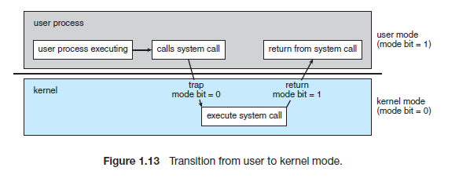

# CS Study - OS(Operating System)

<!-- prettier-ignore -->
|<- 이전 | 현재 | 다음 ->|
|:---:|:---:|:---:|
|[Process & Thread](./os-process-thread.md)|System Call|[CPU Scheduling](./os-cpu_scheduling.md)|

 

# 2. 시스템 콜

## ❓ 시스템 콜에 대해 설명해주세요.

### 시스템 콜(System Call)

운영 체제의 커널이 제공하는 서비스에 대해 응용 프로그램의 요청에 따라 커널에 접근하기 위한 인터페이스

보통 C나 C++과 같은 고급 언어로 작성된 프로그램들은 직접 시스템 호출을 사용할 수 없기에 고급 API를 통해 시스템 호출에 접근하게 해주는 방법

### 시스템 콜이 필요한 이유

우리가 일반적으로 사용하는 프로그램은 '응용프로그램'으로 유저 레벨의 프로그램은 유저 레벨의 함수들 만으로 많은 기능을 수헹하기 힘들기에 커널(kernel)의 도움을 받아야 함

이러한 작업은 응용프로그램으로 대표되는 유저 프로세스(User Process)에서 유저모드에서는 수행할 수 없어 kernel에 관련된 것은 커널모드로 전환해야 해당 작업을 수행할 권한이 생김

커널 모드를 통한 이러한 작업은 반드시 시스템 콜을 통해 수행하도록 설계

> ### 권한이 필요한 이유는 무엇인가?
>
> 악의적인 목적으로 외부에서 시스템 콜을 사용하는 경우나 초보 사용자가 하드웨어 명령어를 잘 몰라 시스템 함수를 호출했을 때 시스템 전체를 망가뜨릴 수도 있기에 안전을 위해 권한을 구현
>
> 따라서 이러한 명령어들은 특별하게 커널 모드에서만 실행할 수 있도록 설계됐고 만약 유저 모드에서 시스템 콜을 호출할 경우에는 운영체제에서 불법적인 접근이라 여기고 trap을 발생함

 

### 시스템 콜의 종류

#### 프로세스 컨트롤

- 프로세스 생성 및 종료
- 메모리에 로드, 실행
- 프로세스 속성 값 확인, 지정
- wait 이벤트, signal 이벤트
- 메모리 할당

#### 파일 메니지먼트

- 파일 생성, 파일 삭제
- 열기, 닫기
- 읽기, 쓰기, Reposition
- 파일 속성 값 확인, 지정

#### 디바이스 매니지먼트

- 디바이스 요청 및 해제
- 읽기, 쓰기, Reposition
- 디바이스 속성 확인, 지정
- 비 물리적인 디바이스 해제 및 장착

#### 정보 관리

- 시간 확인, 시간 지정
- 시스템 데이터 확인, 지정
- 프로세스, 파일, 디바이스 속성 가져오기
- 프로세스, 파일, 디바이스 속성 설정하기

#### 커뮤니케이션

- 커뮤니케이션 연결 생성 및 삭제
- 메시지 송신, 수신
- 상태 정보 전달
- remote 디바이스 해제 및 장착

#### 보안

- Permission 획득
- Permission 설정

 

## ❓ 프로세스가 종료되는 두 가지 조건에 대해 설명해주세요.

### 프로세스 종료(Process Exit)

#### 자발적 종료

- 마지막 statement 수행 후 exit() 시스템 콜을 통해
- 프로그램에 명시적으로 적어주지 안하도 main 함수가 리턴되는 위치에 컴파일러가 넣어준다

#### 비자발적 종료

- 부모 프로세스가 자식 프로세스를 강제로 종료시킨다

  - 자식 프로세스가 한계치를 넘어선 자원을 요청할 때
  - 자식에게 할당된 task가 더 이상 필요하지 않을 때

- 키보드로 kill, break 등을 친 경우

- 부모가 종료하는 경우

  - 부모 프로세스가 종료하기 전에 자식들이 먼저 종료된다

 

- 프로세스가 마지막 명령을 수행한 후 운영체제에게 이를 알려줌(exit)

  - 자식이 부모에게 output data를 보냄 (via wait)
  - 프로세스의 각종 자원들이 운영체제에게 반납

- 부모 프로세스가 자식의 수행을 종료시킴 (abort)

  - 자식이 할당 자원의 한계치를 넘어설 때
  - 자식에게 할당된 테스크가 더 이상 필요하지 않을 때
  - 부모가 종료(exit)해야하는 경우

- 운영체제는 부모 프로세스가 종료하는 경우 자식이 더 이상 수행되도록 하지 않음

- 딸려있는 모든 자식을 종료시킨 후 부모를 죽이는 단계적인 종료

 
