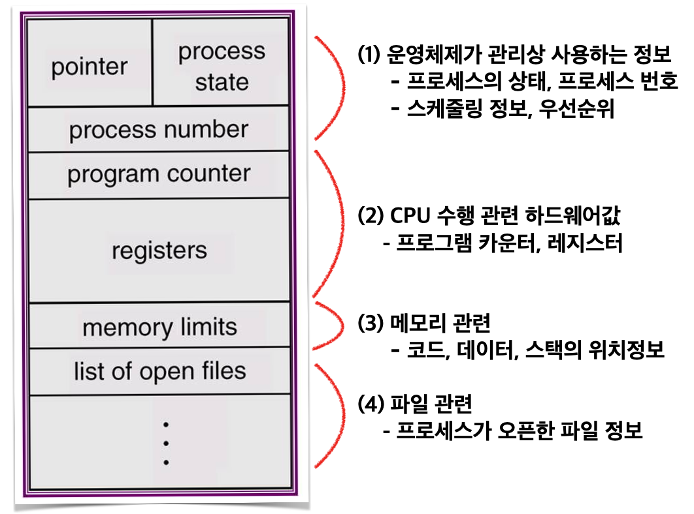

# CS Study - OS(Operating System)

<!-- prettier-ignore -->
|<- 이전 | 현재 | 다음 ->|
|:---:|:---:|:---:|
|[목차](./README.md)|Process & Thread|[System call](./os-system_call.md)|

 

# 1. 프로세스와 스레드

## ❓ 프로세스와 스레드의 차이를 설명하세요.

### 프로세스(Process)

운영체제로부터 자원을 할당 받은 **작업의 단위**

실행 중에 있는 프로그램으로, 메모리에 올라와 실행되고 있는 인스턴스를 말함

작업 스케줄링의 대상이 되는 작업(Task)와 같은 의미로 쓰임

프로세스는 내부에 최소 하나의 스레드를 가지고 있으며, 이 스레드 단위로 스케줄링함

> ### 언제부터 프로세스인가?
>
> 하드디스크에 있는 프로그램이 실행되면 실행을 위한 메모리 할당함
>
> 할당된 메모리에 바이너리 코드로 프로그램이 올라감 <- **이때부터 프로세스**

#### 프로세스의 문맥(context)

- CPU 수행 상태를 나타내는 하드웨어 문맥
  - Pointer
  - Process state
  - Process counter
- Program Counter
- Registers
- Memory Area
  - Code 영역  
    실행할 프로그램의 코드나 명령어들이 기계어 형태로 저장된 영역  
    CPU는 코드영역에 저장된 명령어들을 하나씩 처리
  - Data 영역  
    코드에서 선언한 전역 변수와 정적 변수가 저장되는 영역  
    프로그램이 실행되면서 할당되고 종료되면서 소멸
  - Stack 영역  
    함수 안에서 선언된 지역변수, 매개변수, 리터값등이 저장되는 영역  
    함수 호출시 기록되고 종료되면 소멸
  - Heap 영역  
    관리가 가능한 데이터 이외의 다른 형태의 데이터가 저장되는 영역  
    메모리에 동적 할당된 대부분의 데이터가 여기에 저장

 

- 관련 커널 자료 구조
  - PCB (Process Control Block)
  - Kernel Stack

#### 프로세스의 상태(State)

- New
  - 디스크에서 메모리로 프로그램이 올라가 실행준비를 하는 상태
- Ready
  - CPU 를 기다리는 상태
- Running
  - CPU 를 잡고 instruction 을 수행중인 상태
- Blocked(Waiting, Sleep)
  - CPU를 주어도 당장 instruction 을 수행할 수 없는 상태
  - Process 자신이 요청한 event(예: I/O) 가 즉시 만족되지 않아, 이를 기다리는 상태
  - ex) 디스크에서 file 을 읽어와야 하는 경우
- Terminated(End)
  - 수행 (execution)이 끝난 상태

 

#### 문맥교환(Context Switch)

하나의 프로세스가 이미 CPU를 점유중인 상태에서 다른 프로세스가 CPU를 사용하기 위해 이전 프로세스의 상태를 저장하고 새로운 프로세스의 상태를 적재하는 일

한 프로세서에서 다른 프로세서로 CPU의 제어권을 넘겨주는 일

문맥 교환 발생은 다음과 같음

- CPU의 제어권을 내준 프로세스의 문맥(context)를 그 프로세스의 PCB에 저장
- CPU의 제어권을 얻는 프로세스의 문맥(context)을 PCB로부터 읽어 물리적으로 복원(메모리 or 하드)

> #### 문맥교환이 아닌 경우와 구분하기
>
> - ❌ 문맥교환이 아닌 경우
>   - 사용자 프로세스 A -> interrupt or system call -> 커널모드 -> 문맥 교환 없이 user 모드 복귀 -> 사용자 프로세스 A
> - ⭕ 문맥교환인 경우
>   - 사용자 프로세스 A -> interrupt or I/O 요청 system call -> 커널모드(ISR or system call) -> **문맥 교환 발생** -> 사용자 프로세스 B

 

#### 스케줄러(Scheduler)

운영체제는 하드웨어와 소프트웨어 자원을 줄세우기 위해 여러 Queue를 두어 사용

- Job queue  
  현재 시스템 내에 있는 모든 프로세스의 집합
- Ready queue  
  현재 메모리 내에 있으면서 CPU를 잡아서 실행되기를 기다리는 프로세스의 집합
- Device queues  
  I/O device의 처리를 기다리는 프로세스의 집합

프로세스에게 자원을 할당할지 결정하는 OS 커널의 코드를 말함

- Long-term scheduler(장기 스케줄러 or job scheduler)
- Short-term scheduler(단기 스케줄러 or CPU scheduler)
- Medium-Term Scheduler(중기 스케줄러 or Swapper)

 

### 스레드(Thread)

프로세스가 할당받은 자원을 이용하는 **실행 흐름의 단위**

스레드는 프로세스와 다르게 스레드 간의 메모리를 공유하며 작동함

스레드가 독립적으로 가지고 있는 부분

- program counter(= 실행 흐름)
- register set
- stack space

스레드가 동료 스레드와 공유하는 부분(= Task)

- code section
- data section
- OS resources

 

### 프로세스와 스레드의 차이

프로세스는 운영체제로부터 별도의 메모리 영역을 할당 받고 다른 프로세스와는 메모리를 공유할 수 없지만, 스레드는 Stack을 제외한 Code/Data/Heap 부분은 공유해 서로 읽고 쓸 수 있다.

 

## ❓ 멀티 프로세스와 멀티 스레드의 차이를 설명하세요.

### 멀티 프로세싱(Multi-processing)

다수의 프로세서가 협력적으로 일을 처리하는 것

주의해야 할 점은 단위가 프로세스가 아니라 프로세서인 것으로, 보통 하나의 프로세서(CPU)가 하나의 작업을 맡지만 멀티 프로세싱은 다수의 프로세서가 다수의 작업을 함께 처리하는 것을 의미

하나의 프로세서가 고장이 나도 해당 프로세서가 진행 중인 작업은 다른 프로세서에서 수행하고 있기 때문에 작업이 정지되지 않음

​여러 개의 프로세스가 처리되어야 할 때 동일한 데이터를 사용한다면 각 데이터를 각 프로세서에게 할당할 필요 없이 하나의 공간에 데이터를 저장한 후 이를 공유하여 사용하여 비용 절감

 

### 멀티 프로그래밍(Multi-programming)

하나의 프로세서가 하나의 프로세스를 수행하는 동안 다른 프로세스에 접근할 수 있도록 하는 방법

​멀티 프로그래밍은 입출력이 완료될 때까지 기다리는 시간을 버리지 말고 다른 프로세스를 처리할 수 있도록 해줌

​ 

### 멀티 태스킹(Multi-tasking)

다수의 작업(Task)을 운영체제의 스케줄링에 의해 번갈아 가며 수행되도록 해주는 것

​운영체제가 다수의 작업을 스케줄링하여 아주 짧은 시간 동안 작업을 번갈아가며 수행하여 동시에 수행되는 것처럼 보이게 함

​멀티 태스킹의 스케줄링 방식은 멀티 프로그래밍 방식(Multi-programming), 시분할 방식(Time-sharing), 실시간 시스템 방식(Real-time)을 사용

- ​멀티 프로그래밍  
  위에 언급
- 시분할 방식  
  CPU의 전체 사용 시간을 작은 작업 시간량으로 분할하여 그 시간량 동안 작업에게 번갈아가며 CPU를 할당해 주는 방식
- 실시간 시스템 방식  
  말 그대로 실시간으로 처리하는 것

 

### 멀티 스레딩(Multi-threading)

하나의 프로세스를 다수의 스레드로 구분하여 자원을 공유하고 자원의 생성과 관리의 중복성을 최소화하여 수행 능력을 향상시키는 것

하나의 프로세스가 동시에 여러 개의 스레드를 수행할 수 있도록 해줌

​하나의 프로세스에는 하나 이상의 스레드가 존재할 수 있으며, 프로세스를 생성하는 비용보다 스레드를 생성하는 비용이 더 저렴하기 때문에 프로세스에 다수의 스레드를 생성하여 병렬처리

​프로세스는 데이터, 힙, 스택 영역을 서로 공유하지 않지만 스레드는 스택 영역을 제외한 데이터, 힙 영역을 서로 공유하기 때문에 메모리 부분에서도 훨씬 효율적

 
