# Database

# 1) Database

## 📔 무결성 (integrity)

---

### 1. 무결성에 대해 설명해주세요.

❓ 데이터의 **정확성**, **일관성**, **유효성**을 **유지**하는 것

### 2. 무결성을 유지하려는 이유가 무엇인가요?

✔️ 무결성이 유지되어야 데이터베이스에 저장된 데이터 값과 그 값에 해당하는 **현실 세계의 실제 값이 일치하는지에 대한 신뢰**가 생김.

- **개체 무결성** : 기본키로 선택된 필드는 빈 값을 허용하지 않음.
- **참조 무결성** : 서로 참조 관계에 있는 두 테이블의 데이터는 항상 일관된 값을 유지해야 함.
- **고유 무결성** : 특성 속성에 대해 고유한 값을 가지도록 조건이 주어진 경우 그 속성 값은 모두 고유한 값을 가짐.
- **NULL 무결성** : NOT NULL 조건이 주어진 경우, 그 속성 값은 NULL이 될 수 없다는 제약 조건

## 📔 인덱스 (Index)

---

### 1. DB 인덱스에 대해 설명해주세요.

❓ **데이터를 빠르게 찾을 수 있게** 해주는 하나의 장치 (ex. 책의 마지막 장에 있는 찾아보기)

- 특정 컬럼에 인덱스를 생성하면, 해당 컬럼의 데이터들을 정렬하여 별도의 메모리 공간에 데이터의 물리적 주소와 함께 저장됨.
- 인덱스 생성 시 데이터를 **오름차순으로 정렬**하기 때문에 정렬된 주소체계라고 표현할 수 있음.

### 2. DB 인덱스를 사용하는 이유는 무엇인가요?

- **조건 검색에서 효율적**이기 때문
- **조건 검색 WHERE 절의 효율성 →** 인덱스 테이블 스캔(Index Table Scan) 시 인덱스 테이블은 데이터들이 정렬되어 저장되어 있기 때문에 해당 조건(WHERE)에 맞는 데이터들을 빠르게 찾아낼 수 있음.
- ****정렬 ORDER BY 절의 효율성 →**** 정렬되어 있기 때문에 ORDER BY에 의한 정렬(Sort) 과정을 피할 수가 있음.
- ****MIN, MAX의 효율적인 처리가 가능→**** 이미 정렬 되어 있기 때문에 MIN값과 MAX값을 레코드의 시작 값과 끝 값 한 건씩만 가져오면 됨.

### 3. DB 인덱스에 해쉬 보다 B Tree를 쓰는 이유는 무엇인가요?

- **해쉬 테이블**은 저장되는 값들은 정렬되어 있지 않기 때문에 특정 값보다 크거나 작은 값을 찾을 수 없음.
- **B-Tree**는 **루트 노드 - 브랜치 노드 - 리프노드**로 이루어져 있는데 ****노드 내의 데이터들은 **항상 정렬된 상태**이기 때문에 **데이터 검색 시 더 효율적**임.
- **트리의 대수 확장성** 때문에 더 효율적임.

→ 트리의 대수 확장성이란 : 트리 깊이가 리프 노드 수에 비해 매우 느리게 성장하는 것.

→ 기본적으로 인덱스가 한 깊이씩 증가할 때마다 최대 인덱스 항목의 수는 4배씩 증가

## 📔 관계형 DB vs 비관계형 DB

---

### 1. 관계형 DB 와 비관계형 DB 의 차이점에 대해 설명해주세요.

✔️ **관계형 DB** 

- 행과 열을 가지는 표 형식 데이터를 저장하는 형태의 DB를 가리킴.
- SQL 언어를 사용하여 조작

✔️ **비관계형 DB**

- SQL을 사용하지 않는 DB
- NoSQL(Not only SQL)이라는 슬로건에서 생겨난 DB

### 2. RDBMS과 비교하였을 때 NoSQL의 장점을 설명해보세요.

- RDBMS 는 스키마가 엄격하게 적용이 되는데 NoSQL은 스키마가 없기 때문에 유연성이 좋음.

→ 언제든지 데이터를 조정하고 새로운 필드를 추가할 수 있음.

- 확장성이 좋고 Application이 필요로 하는 형태로 저장되기 때문에 데이터를 읽어오는 속도가 빠름.

### 3. 어떤상황에서 NoSQL을 쓰는 것이 더 적합한가?

- 데이터에 대한 캐시가 필요한 경우
- 배열 형식의 데이터를 고속으로 처리할 필요가 있는 경우
- 정확한 데이터 구조를 알 수 없거나 변경 / 확장 될 수 있는 경우
- 읽기(read)처리를 자주하지만, 데이터를 자주 변경(update)하지 않는 경우 → 즉, 한번의 변경으로 수십 개의 문서를 업데이트 할 필요가 없는 경우
- 데이터베이스를 수평으로 확장해야 하는 경우 → 막대한 양의 데이터를 다뤄야 하는 경우

## 📔 트랜잭션 (Transaction)

---

### 1. 트랜잭션이란?

❓ 데이터베이스에서 하나의 논리적 기능을 수행하기 위한 **작업의 단위**, DB에 접근하는 방법은 쿼리이므로 여러 개의 **쿼리들을 하나로 묶는 단위**를 말한다.

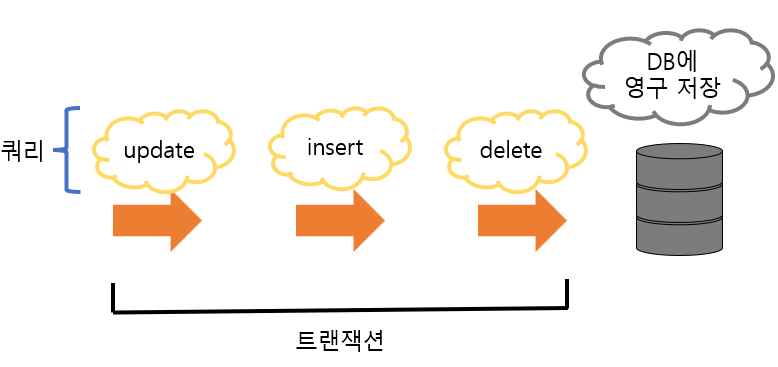

### 2. 트랜잭션의 성질 ACID

✔️ **원자성**(**A**tomicity)

- 트랜잭션과 관련된 일이 모두 수행되었거나 되지 않았거나를 보장하는 특징
- 트랜잭션을 커밋했는데 문제가 발생하여 트랜잭션 전으로 되돌리는 것(롤백)을 보장하는 것을 말함.

✔️ **일관성**(**C**onsistency)

- 허용된 방식으로만 데이터를 변경해야 하는 것을 의미
- 데이터베이스에 기록된 모든 데이터는 여러 가지 조건, 규칙에 따라 유효함을 가져야 함.

✔️ **격리성**(**I**solation)

- 트랜잭션 수행 시 서로 끼어들지 못하는 것
- 복수의 병렬 트랜잭션은 서로 격리되어 마치 순차적으로 실행되는 것처럼 작동되어야 하고, 데이터베이스는 여러 사용자가 같은 데이터에 접근할 수 있어야 함. → 만약 순차적으로 한다면 성능이 나빠짐.

✔️ **지속성**(**D**urability)

- 성공적으로 수행된 트랜잭션은 영원히 반영되어야 하는 것을 의미
- 데이터베이스에 시스템 장애가 발생해도 원래 상태로 복구하는 회복 기능이 있어야 함을 뜻함.

### 3. 트랜잭션을 병행으로 처리할 때 발생할 수 있는 문제점과 이를 방지하기 위한 방법

### **<문제점>**

✔️ **갱신 분실 (Lost Update)**

- 같은 데이터에 대해 둘 이상의 트랜잭션이 동시에 갱신할 때, **갱신 결과의 일부가 없어지는 현상**

✔️ **모순성(Inconsistency)**

- 하나의 트랜잭션이 여러 데이터 갱신 연산을 수행할 때, 일관성 없는 상태의 데이터베이스에서 데이터를 가져옴으로써 데이터의 불일치가 발생하는 것

✔️ **연쇄 복귀 (Cascading Rollback)**

- 병행 수행되던 둘 이상의 트랜잭션 중 어느 한 트랜잭션에 오류가 발생하여 Rollback 하는 경우 다른 트랜잭션들도 함께 Rollback 되는 현상

✔️ **비완료 의존성 (uncommitted Dependency)**

- 하나의 트랜잭션 수행이 실패한 후 회복하기 전에 다른 트랜잭션이 실패한 갱신 결과를 참조하는 현상

### **<방지하기 위한 방법>**

✔️ **로킹 (Locking)**

- 트랜잭션이 접근하려는 데이터를 다른 트랜잭션이 접근하지 못하도록 잠그는(lock) 병행 제어 기법
- 이를 통해 **상호 배제(Mutual Exclusive) 기능**을 제공하며, 잠금을 설정한 트랜잭션이 해제(unlock)할 때까지 데이터를 **독점적**으로 사용할 수 있음.

✔️ **2단계 로킹 규약 (Two-Phase Locking, 2PL)**

- 각 트랜잭션의 lock과 unlock 요청을 2단계로 실시하는 방식
- 단순 잠금 연산만으로는 항상 직렬 가능한 스케줄을 보장하지 못하기 때문에 2단계 잠금 규약(2PL)을 사용하여 이를 해결
- 이를 통해 직렬성을 보장하는 대표적인 로킹 규약이지만 여전히 lock 연산으로 인한 교착상태를 예방할 수는 없다는 단점
- **확장 단계(Growing phase)** : 새로운 lock 연산만을 수행할 수 있고, unlock 연산은 수행할 수 없는 단계
- **축소 단계(shrinking phase)** : unlock 연산을 수행할 수 있고, lock연산은 수행할 수 없는 단계

✔️ **타임스탬프 순서 (Timestamp ordering) 기법**

- 비직렬 트랜잭션을 타임스탬프 순서에 따라 직렬화 시키는 방법
- 데이터에 접근하는 시간(Timestamp)을 미리 정해두어 부여된 시간 순서대로 데이터에 접근하며, lock을 사용하지 않고 시간을 나눠 사용하기 때문에 교착 상태(Dead lock)가 발생하지 않는다.
- 하지만, Rollback 발생률이 높고 연쇄 복귀를 초래할 수 있는 단점

✔️ **낙관적 병행 제어 (Optimistic Concurrency Control)**

- 트랜잭션 수행 동안은 어떠한 검사를 하지 않고, 트랜잭션이 종료된 이후에 일괄적으로 검사하는 방식
- 수행 도중에는 트랜잭션을 위해 유지되는 데이터 항목들의 지역 사본에 대해서만 갱신하고, 트랜잭션이 종료되고 난 후에 직렬화를 검증하여 검증되면 데이터베이스에 한 번에 반영하는 방식

✔️ **다중 버전 병행 제어 (Multi-version Concurrency Control)**

- 한 데이터에 대해 여러 버전의 값을 유지하며 관리하는 방식
- 여러 버전의 타임스탬프를 비교하여 스케줄상 직렬 가능성이 보장되는 타임스탬프를 선택
- 충돌이 발생할 경우 연쇄 복귀가 발생할 수 있는 단점

### 3-1. Locking 제어 기법을 사용할 때 Locking 단위를 크게/작게 했을 때의 차이점

✔️ **Locking 단위** 

- 한 번에 로킹 할 수 있는 객체의 크기
- **필드**, **레코드**, **테이블**, **파일**, **데이터베이스** 모두 로킹 단위가 될 수 있음.

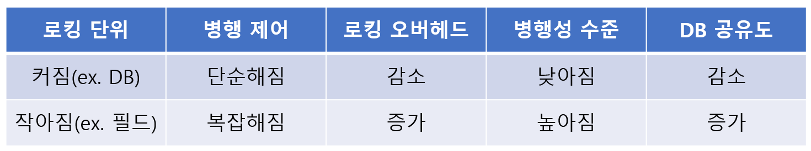

### 4. 트랜잭션에 의해 발생할 수 있는 데드락에 대해 설명

✔️ **교착상태(DeadLock)**

❓ 여러 개의 트랜잭션(Transaction)들이 실행을 하지 못하고 서로 무한정 기다리는 상태

- **트랜잭션 1** 이 **테이블 A에 insert**를 하게 되면 Lock을 얻는다.
- **트랜잭션 2** 가 **테이블 B에 insert**를 하게 되면 Lock을 얻는다.
- **commit을 하지 않은 상태에서**
- **트랜잭션 1 은 테이블 B에 insert** 하고 **트랜잭션 2는 테이블 B에 insert**를 하면 **deadlock 발생**

### 4-1. 데드락을 방지할 수 있는 방법은?

✔️ **예방 기법**

- 각 트랜잭션이 실행되기 전에 필요한 모든 자원을 Lock(잠금)함.

→ 필요한 모든 데이터를 Lock(잠금)해야 하므로 병행성이 떨어짐.

- SET LOCK_TIMEOUT문을 통해 일정 시간이 지나면 쿼리를 취소함.

→ 기존의 교착상태인 데이터가 있다면, 그 데이터에 접근하는 쿼리만 취소

→ 즉, 근본적인 해결책이 될 수 없음.

✔️ **회피 기법**

- 자원을 할당할 때 시간 스탬프(Time Stamp)를 활용해서 교착상태가 일어나지 않도록 회피하는 방법
- **Wait-Die 방식**

→ 트랜잭션 A가 트랜잭션 B에 의해 잠금된 데이터를 요청할 때 트랜잭션 A이 먼저 들어온 트랜잭션이라면 대기(Wait)함.

→ 트랜잭션 A가 나중에 들어온 트랜잭션이라면, 포기(Die)하고 나중에 다시 요청함.

- **Wound-Wait 방식**

→ 트랜잭션 A가 트랜잭션 B보다 먼저 들어온 트랜잭션이라면, 데이터를 선점(Wound)함.

→ 반면, 트랜잭션A가 트랜잭션 B보다 나중에 들어온 트랜잭션이라면 대기(Wait)함.

✔️ **낙관적 병행 제어 기법**

- **판독->확인->기록** 단계를 따름.
- **확인 단계**를 성공적으로 거친 트랜잭션만  **기록 단계**를 수행할 수 있음.

✔️ **빈도 줄이기 기법**

- 트랜잭션을 자주 커밋하기
- 정해진 순서로 테이블에 접근하기
- 읽기 잠금 (SELECT ~ FOR UPDATE)의 사용을 피하기
- 테이블 단위의 Lock(잠금)을 획득해 갱신을 직렬화하기 → 테이블의 복수행을 복수의 연결에서 순서 없이 갱신하면 교착상태가 자주 발생하기 때문
- Index 설계 → Update시 Index를 고려하지 않으면 테이블 전체에 Lock이 걸릴 수 있음.
- Isolation level(고립 수준)을 낮추기 → 서비스 검토 필요

### 5. 트랜잭션 격리 수준의 각 레벨에 대해 간략하게 설명

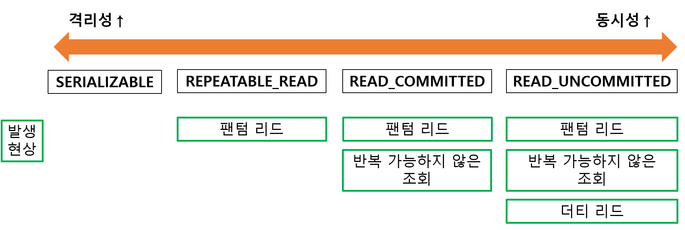

✔️ **SERIALIZABLE**

- 트랜잭션을 **순차적**으로 진행시키는 것
- 여러 트랜잭션이 동시에 같은 행에 접근 불가
- 따라서 교착 상태가 일어날 확률도 많고 가장 성능이 떨어지는 격리 수준

✔️ **REPEATABLE_READ**

- 하나의 트랜잭션이 수정한 행을 다른 트랜잭션이 수정할 수 없도록 막아주지만 새로운 행을 추가하는 것은 막지 않음.
- 따라서 이후에 추가된 행이 발견될 수도 있음.

✔️ **READ_COMMITTED**

- **가장 많이 사용**되는 격리 수준
- **커밋 완료된 데이터에 대해서만 조회를 허용**
- 하지만 어떤 트랜잭션이 접근한 행을 다른 트랜잭션이 수정할 수 있음. 예를 들어 트랜잭션 A가 수정한 행을 트랜잭션 B가 수정할 수도 있음. 이 때문에 트랜잭션 A가 같은 행을 다시 읽을 때 다른 내용이 발견될 수 있음. → 이게 반복 가능하지 않은 조회인가?

✔️ **READ_UNCOMMITTED**

- 가장 낮은 격리 수준
- 하나의 트랜잭션이 **커밋되기 이전에 다른 트랜잭션에 노출되는 문제**가 있지만 **가장 빠름**.
- 데이터 무결성을 위해 되도록이면 사용하지 않는 것이 이상적이나, 거대한 양의 데이터를 ‘어림잡아’ 집계하는 데는 사용하면 좋음.

**<격리 수준에 따라 발생하는 현상>**

✔️ **팬텀 리드**(phantom read) 

- 한 트랜잭션 내에서 동일한 쿼리를 보냈을 때 해당 **조회 결과가 다른 경우**

**ex)** 사용자 A가 회원 테이블에서 age가 12 이상인 회원들을 조회하는 쿼리를 보낸다고 했을 때, 결과로 세 개의 테이블이 조회한다고 하자, 그 다음 사용자 B가 age 15인 회원 레코드를 삽입하면, 세 개가 아닌 네 개의 테이블이 조회됨.

✔️ **반복 가능하지 않은 조회**(non-repeatable read)

- 한 트랜잭션 내의 **같은 행에 두 번 이상 조회**가 발생했는데, 그 **값이 다른 경우**

**ex)** 사용자 A가 큰돌의 보석 개수가 100개라는 값을 가진 데이터였는데, 그 이후 사용자 B가 그 값을 1로 변경해서 커밋했다고 하면 사용자 A는 100이 아닌 1을 읽게 됨.

- 팬텀 리드와 다른 점 : 반복 가능하지 않은 조회는 행 값이 달라질 수도 있는데, 팬텀 리드는 다른 행이 선택될 수도 있다는 것을 의미
- 

✔️ **더티 리드**(dirty read) 

- 한 트랜잭션이 실행 중일 때 다른 트랜잭션에 의해 수정되었지만 **아직 ‘커밋되지 않은**’ 행의 데이터를 읽을 수 있을 때 발생

**ex)** 사용자 A가 큰돌의 보석 개수 100을 1로 변경한 내용이 ‘커밋되지 않은’ 상태라도 그 이후 사용자 B가 조회한 결과가 1로 나오는 경우

### 6. COMMIT과 ROLLBACK에 대해 설명해주세요.

- commit과 rollback 덕에 **데이터의 무결성이 보장**되고 데이터 변경 전에 변경 사항을 쉽게 확인할 수 있고 해당 작업을 그룹화 할 수 있음.

✔️ **COMMIT** 

- 여러 쿼리가 성공적으로 처리되었다고 확정하는 명령어
- 트랜잭션 단위로 수행되며 변경된 내용이 모두 영구적으로 저장되는 것을 말함.

```
"**커밋이 수행되었다.**" == "**하나의 트랜잭션이 성공적으로 수행되었다.**"
```

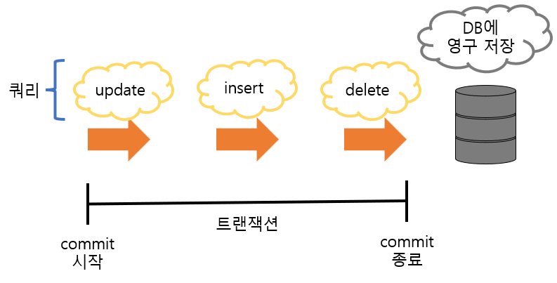

✔️ **ROLLBACK**

- 에러나 여러 이슈 때문에 트랜잭션 전으로 되돌리는 것(취소)

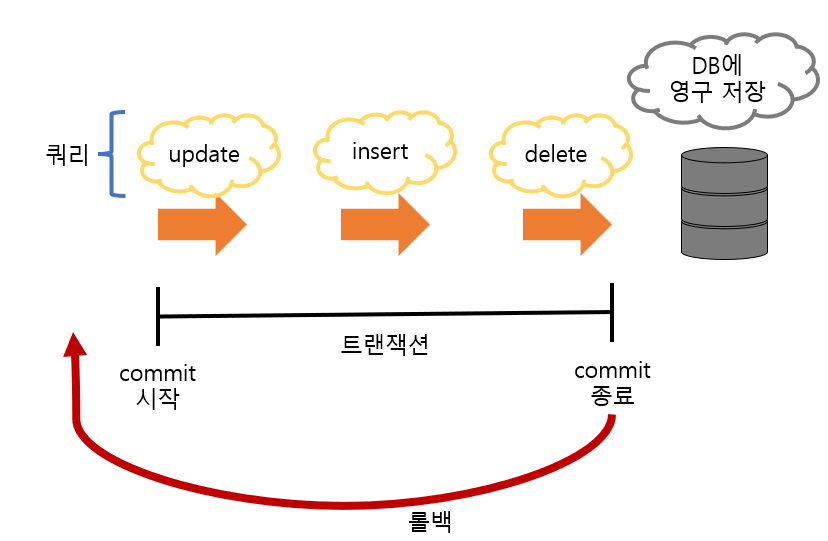

## 📔 데이터 모델링

---

### 1. 다양한 데이터 모델에 대해서 설명해주세요.

✔️ **개념적 데이터 모델**

- 비즈니스 및 데이터에 대한 전반적인 구조를 정의
- 엔터티와 엔터티 관계는 모두 개념적 모델에서 정의(ERD)

✔️ **논리적 데이터 모델**

- 개념적 모델링을 논리적 모델링으로 변환
- 식별자를 도출하고 엔터티의 속성과 관계 등 필요한 모든 릴레이션을 정의
- 정규화를 수행하여 데이터 모델의 독립성을 확보하고 재사용성을 높임.

✔️ **물리적 데이터 모델**

- 데이터 모델링 과정의 마지막 단계
- 데이터베이스를 실제 구축

### 2. 데이터 모델링의 디자인 스키마에 대해서 설명해주세요.

- 스키마 : 데이터베이스에 대한 설명서 (**구조**/뼈대)
- **외부 스키마** : 개개 사용자가 보는 개인적 DB 스키마
- **개념 스키마** : 모든 사용자 관점을 통합한 조직 전체의 DB를 기술하는 것
- **내부 스키마** : 물리적 장치에서 데이터가 실제적으로 저장되는 방법을 표현하는 것

### 

## 📔 정규화 (Normalization)

---

### 1. 정규화란 무엇인지, 필요한 이유와 함께 답변해주세요.

❓ 릴레이션 간의 잘못된 종속 관계로 인해 **데이터베이스 이상 현상**이 일어나서 이를 **해결**하거나, 저장 공간을 효율적으로 사용하기 위해 **릴레이션을 여러 개로 분리**하는 과정 (중복 최소화)

- 이상 현상을 제거와 데이터 중복 최소화를 위해 정규화 과정이 필요함.

✔️ ****이상현상(Anomaly)****

- 삽입이상(****Insertion anomaly)****
    - 특정 데이터가 존재하지 않아 중요한 데이터를 데이터베이스에 삽입할 수 없을 때 발생
    
    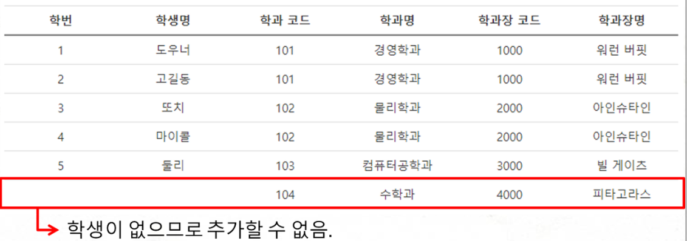
    

➡️ 대학교 Table에서 새로운 학과를 추가하려고 할 때 학생명이 없으면 새로운 학과 추가 불가

- 삭제이상(****Deletion anomaly)****
    - 특정 정보를 삭제하면, 원치 않는 정보도 삭제되는 현상
    
    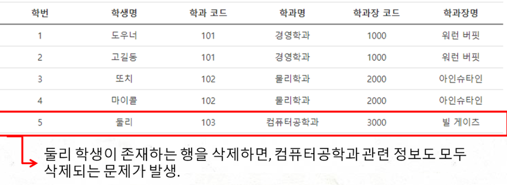
    

- 갱신이상(****Update anomaly)****
    - 테이블의 특정 데이터를 업데이트했는데, 정상적으로 변경되지 않은 경우 그리고 너무 많은 행을 업데이트하는 것
    
    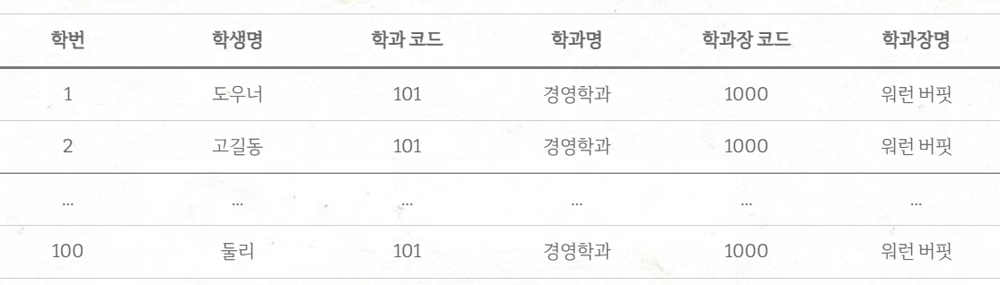
    

➡️ 위 테이블에서 경영학과의 학과장 코드와 학과자명을 변경하고자 할 때 100개의 데이터를 하나하나 다 바꿔줘야 함.

### 2. 각 정규화 단계에 대해 **만족되어야 할 조건**을 중심으로 설명해주세요.

✔️ **제1정규형(1NF)**

❓ 테이블(릴레이션)의 컬럼(도메인)이 원자값(Atomic Value, 하나의 값)을 갖도록 테이블을 분해하는 것 ⇒ 도메인 원자값

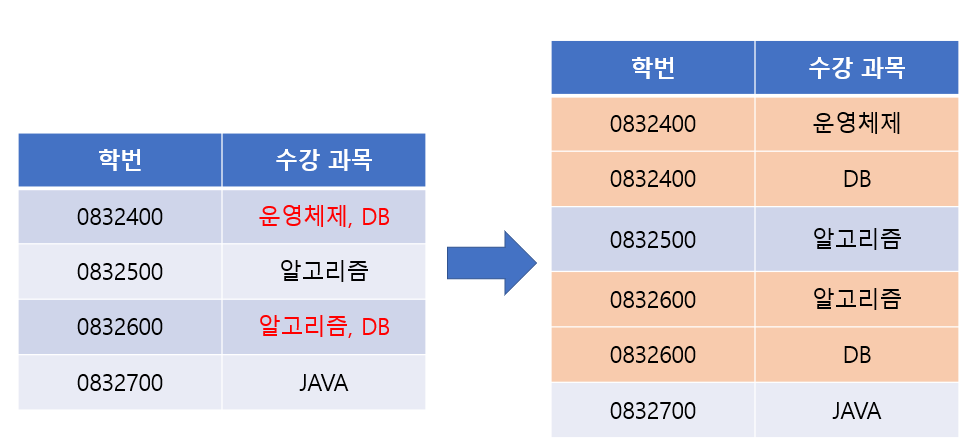

✔️ **제2정규형(2NF)**

❓ 제1정규형이며 부분 함수의 종속성을 제거한 형태 ⇒ 부분적 함수 종속 제거

- 즉, 기본키의 부분 집합이 결정자가 되어선 안된다는 것

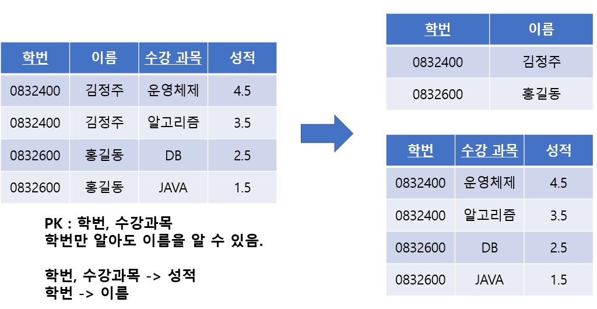

✔️ **제3정규형(3NF)**

❓ 제2정규형이며 기본키가 아닌 모든 속성이 이행적 함수 종속(transivive FD)을 만족하지 않는 상태 ⇒ 이행적 함수 종속 제거

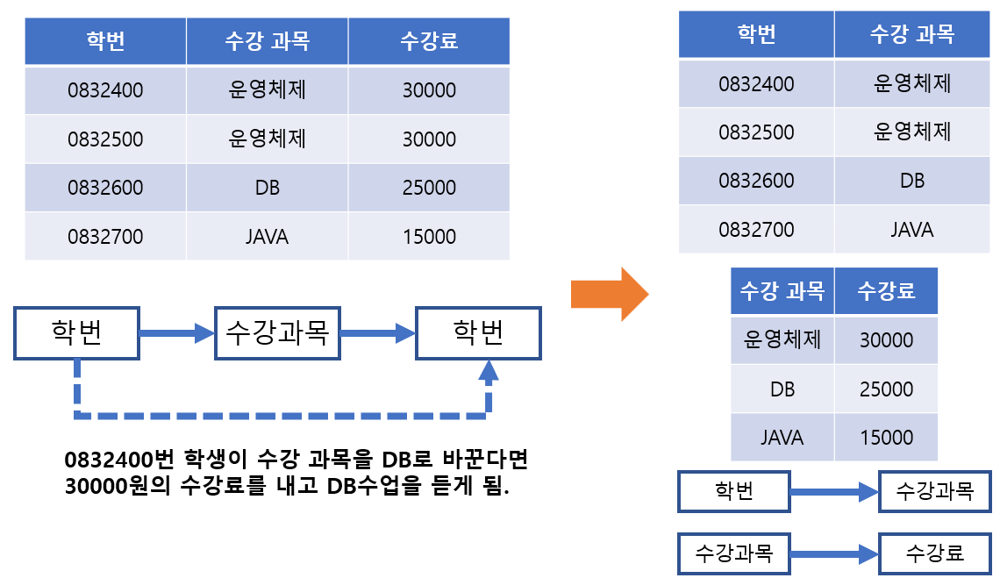

✔️ **보이스/코드 정규형(BCNF)**

❓ 제3정규형이며, 결정자인데 후보키가 아닌 것을 모두 제거한 상태

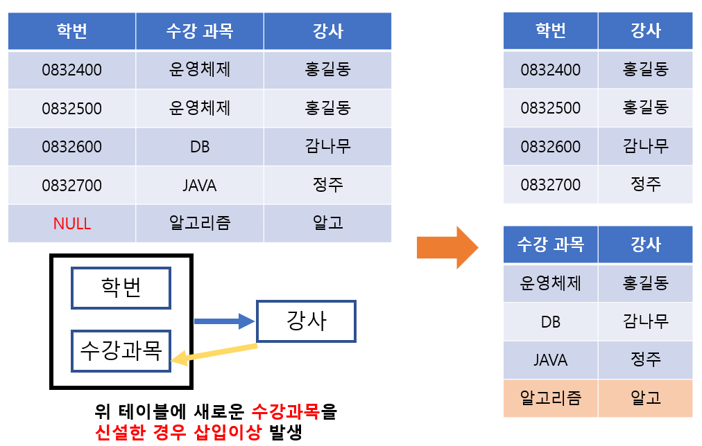

✔️ **제4정규형(4NF)**

❓BCNF이며 다치 종속 제거된 상태

✔️ **제5정규형(5NF)**

❓ 제4정규형이며 조인 종속이 없는 상태

### 3. 함수적 종속에 대해 설명해주세요.

- 데이터베이스의 릴레이션 R(테이블)에서 X와 Y를 R의 부분집합이라고 할 때, X의 값 각각에 대해 Y의 값이 오직 하나로 결정 될때 Y는 X에 종속 된다고 함.
- 즉, 테이블의 한 필드값(X, 결정자)이 다른 필드값(Y, 종속자)을 결정하는 관계를 함수 종속이라고 함.
- **y=f(x)** 와 같은 관계

### 4. 완전함수적 종속/부분함수적 종속/이행함수적 종속에 대해 설명해주세요.

- **완전함수적 종속** : 종속자가 기본키에만 종속되는 것, 기본키가 여러 속성으로 구성되어 있을경우 기본키를 구성하는 모든 속성이 포함된 기본키의 부분집합에 종속된 경우 → **제2정규형**인 상태
- **부분함수적 종속** : 기본키의 부분 집합이 결정자가 되는 것, 종속자가 기본키가 아닌 다른 속성에 종속되거나, 기본키가 여러 속성으로 구성되어 있을 경우 기본키를 구성하는 속성 중 일부만 종속된 경우
- **이행적 함수 종속** : A→ B 와 B→ C가 존재하면 논리적으로 A→C가 성립하는데, 이 때 집합C가 집합 A에 이행적으로 함수 종속 되었다고 함.

### 5. 역정규화를 하는 이유는 무엇인가요?

- 역정규화는 정규화된 데이터베이스에서 성능을 개선하기 위해 사용되는 전략으로, 테이블을 나누게 되면 조인을 하는 과정에서 검색 시간이 더 늘어날 수도 있기 때문에 서비스에 따라 역정규화를 하게 됨.

## 📔 기타

### 1. 데이터베이스 장애에 대해 설명해주세요.

- 장애(Failure)는 시스템이 제대로 동작하지 않는 상태

✔️ **트랜잭션 장애**

- 트랜잭션 수행 중 오류가 발생하여 정상적으로 수행을 계속할 수 없는 상태
- 원인 : 트랜잭션의 논리적 오류, 잘못된 데이터 입력, 처리 대상 데이터의 부재 등등

✔️ **시스템 장애**

- 하드웨어의 결함으로 정상적으로 수행을 계속할 수 없는 상태
- 하드웨어 이상으로 메인 메모리에 저장된 정보가 손실되거나 교착 상태가 발생하는 경우 등등

✔️ **미디어 장애**

- 디스크 장치의 결함으로 디스크에 저장된 데이터베이스 일부나 전체가 손상된 상태

### 2. 데이터베이스 회복 기법에 대해 설명해주세요.

- 회복은 데이터베이스에 장애가 발생했을 때 장애가 발생하기 전의 일관된 상태로 복구시키는 것으로, 데이터베이스 관리 시스템의 회복 관리자가 담당함.
- 별도의 장소에 미리 복사해두고, 장애가 발생했을 때 복사본을 이용해 원래의 상태로 복원

**<데이터의 복사 방법>**

- **덤프(dump)** : 데이터 베이스 전체를 다른 저장 장치에 주기적으로 복사하는 방법 → **redo(재실행) 연산**
- **로그(log) :** 데이터베이스에서 변경 연산이 실행될 때마다 데이터를 변경하기 이전 값과 변경한 이후의 값을 별도의 파일에 기록하는 방법 → **undo(취소) 연산**

### 3. SQL Injection에 대해 설명해주세요

- 악의적인 사용자가 보안상의 취약점을 이용하여, 임의의 SQL 문을 주입하고 실행되게 하여 데이터베이스가 비정상적인 동작을 하도록 조작하는 행위 → **'코드 인젝션'**  공격 기법 중 하나
- 서버의 데이터베이스를 대상으로 하는 공격
- 사용자 입력값을 제대로 필터링, 이스케이프 하지 않아 발생
- 2017년 3월에 일어난 “여기어때” 의 대규모 개인정보 유출 사건도 SQL Injection 으로 인해 피해가 발생

✔️ **논리적 에러를 이용한 SQL Injection** 

- 가장 많이 쓰이고, 대중적인 공격 기법
- ex. 로그인시 사용되는 쿼리 문에서 where 절에 항상 참이 되도록 SQL 구문을 주입하여 관리자 계정으로 로그인하여 2차 피해 발생 시킴.
- 입력값에 대한 검증이 없기 때문에 발생

✔️ **Union 명령어를 이용한 SQL Injection**

- 정상적인 쿼리문에 Union 키워드를 사용하여 인젝션에 성공하면, 원하는 쿼리문을 실행할 수 있게 됨.
- 입력값에 대한 검증이 없기 때문에 발생

✔️ **Boolean based SQL**

- 데이터베이스로부터 특정한 값이나 데이터를 전달받지 않고, 단순히 참과 거짓의 정보만 알 수 있을 때 사용
- 로그인 폼에 SQL Injection이 가능하다고 가정 했을 때, 서버가 응답하는 로그인 성공과 로그인 실패 메시지를 이용하여, DB의 테이블 정보 등을 추출해 낼 수 있음.

✔️ **Time based SQL**

- 서버로부터 특정한 응답 대신에 참 혹은 거짓의 응답을 통해서 데이터베이스의 정보를 유추하는 기법
- 사용되는 함수는 MySQL 기준으로 SLEEP 과 BENCHMARK

### <대응 방안>

- **입력 값에 대한 검증**
- **Prepared Statement 구문사용 :** 사용자의 입력 값이 데이터베이스의 파라미터로 들어가기 전에DBMS가 미리 컴파일 하여 실행하지 않고 대기, 사용자의 입력은 이미 의미 없는 단순 문자열 이기 때문에 전체 쿼리문도 공격자의 의도대로 작동하지 않음.
- **Error Message 노출 금지**
- **웹 방화벽 사용**

### 4. HINT(힌트)는 무엇인가요?

- **SQL 튜닝의 핵심 부분으로 일종의 지시 구문**
- 오라클 Optimizer에게 SQL문 실행을 위한 데이터를 스캐닝하는 경로, 조인 방법 등을 알려주기 위해 SQL 사용자가 SQL 구문에 작성하는 것을 뜻함.
- 오라클이 항상 최적의 실행 경로를 만들어 내기는 불가능하기 때문에 **직접 최적의 실행 경로를 작성해 주는 것**
- **사용자가 특정 SQL 문장에서 어떤 인덱스가 선택도가 높은지 알고 있는 경우** Optimizer에 의존한 실행 계획보다 **훨씬 효율적인 실행 계획을 구사할 수 있음.**
- **기본 사용법 :** 쿼리 서두에 힌트를 명시하는 것

---

- 참고

[[데이터베이스]이상 현상(Anomaly)](https://developer-talk.tistory.com/256)

[[Database] 정규화(Normalization) 쉽게 이해하기](https://mangkyu.tistory.com/110)

[https://itwiki.kr/w/함수적_종속성](https://itwiki.kr/w/%ED%95%A8%EC%88%98%EC%A0%81_%EC%A2%85%EC%86%8D%EC%84%B1)

[https://sangwoo0727.github.io/database/Database-10_failure_recovery/](https://sangwoo0727.github.io/database/Database-10_failure_recovery/)

[https://noirstar.tistory.com/264](https://noirstar.tistory.com/264)

[https://velog.io/@gillog/SQL-Plan-Hint](https://velog.io/@gillog/SQL-Plan-Hint)

[https://rebro.kr/163](https://rebro.kr/163) - 트랜잭션 병행 문제점

[https://jaehoney.tistory.com/162?category=887684](https://jaehoney.tistory.com/162?category=887684) - 데드락

[https://choicode.tistory.com/27](https://choicode.tistory.com/27) - DB 인덱스 장점

[https://siahn95.tistory.com/entry/DB-인덱스란-2-구조-B-Tree-계열을-쓰는-이유](https://siahn95.tistory.com/entry/DB-%EC%9D%B8%EB%8D%B1%EC%8A%A4%EB%9E%80-2-%EA%B5%AC%EC%A1%B0-B-Tree-%EA%B3%84%EC%97%B4%EC%9D%84-%EC%93%B0%EB%8A%94-%EC%9D%B4%EC%9C%A0) - DB 인덱스 해쉬, B-Tree

[https://sujl95.tistory.com/83](https://sujl95.tistory.com/83) - NoSQL

[https://coding-factory.tistory.com/869](https://coding-factory.tistory.com/869) - 데이터 모델링
