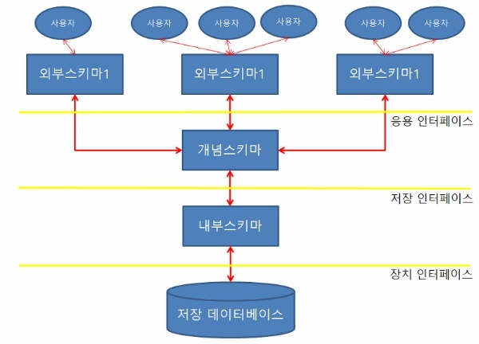
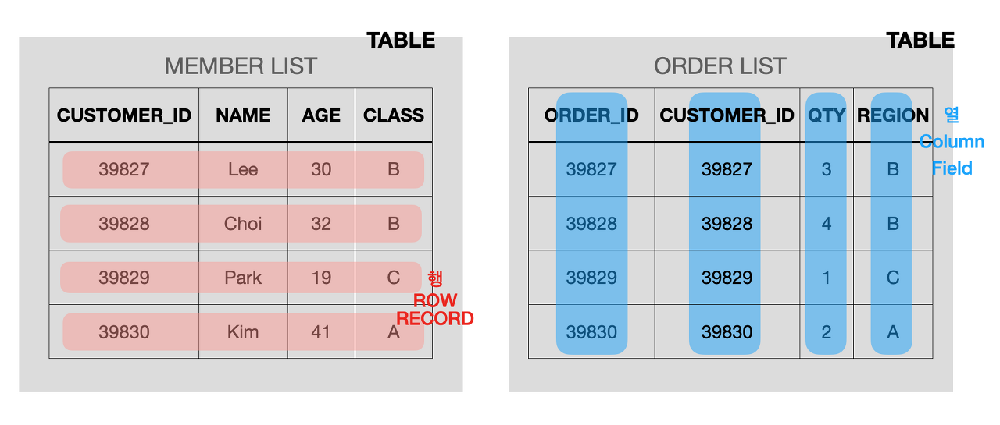
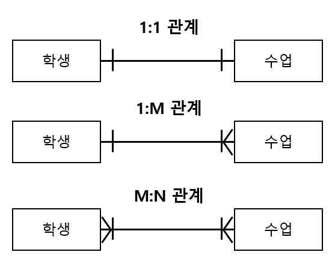

# CS Study - DB

빠른 이동
|<- 이전 | 현재 | 다음 ->|
|:---:|:---:|:---:|
|[목차](./README.md)|데이터베이스의 기본|[ERD와 정규화](./db-erd-&-normalization.md)|

## 1. 데이터베이스의 기본

- ### 데이터베이스(DataBase)란?

  여러 사람이 공유할 목적으로 체계화해 통합, 관리하는 데이터의 집합체  
  중복된 데이터를 없애고 자료를 구조화 하며 효율적인 처리를 할 수 있도록 관리  
  <br/>

- ### 엔터티(Entity)

  데이터베이스로 표현하고자 하는 실체 또는 객체를 나타내는 것  
  엔터티는 인스턴스의 집합으로 나타냄  
  <br/>

  엔터티의 특징

  - 반드시 엔터티가 사용되는 곳의 업무에서 필요하며 관리하고자 하는 정보
  - 엔터티가 포함하는 인스턴스에 대해 유일한 식별자로 식별이 가능해야 함
  - 엔터티는 지속적으로 존재하는 두개 이상의 인스턴스들의 조합이어야 함
  - 엔터티는 반드시 속성을 지녀야 함
  - 엔터티는 업무 프로세스에 의해서 이용되어야 함
  - 엔터티는 다른 엔터티와 최소 한 개 이상의 관계가 있어야 함  
    <br/>

  엔터티 실제형에 따른 분류

  - 유형 엔터티(Tangible Entity)  
    물리적인 형태가 존재하는 엔터티이며 안정적이고 지속적으로 활용되는 엔터티
  - 개념 엔터티(Conceptual Entity)  
    물리적인 형태는 존재하지 않고 관리해야 할 개념적인 정보로 구분이 되는 엔터티
  - 사건 엔터티(Event Entity)  
     업무를 수행함에 따라 발생되는 엔터티  
    <br/>

  발생시점에 따른 분류

  - 기본/키 엔터티(Fundamental/Key Entity)  
    해당 업무에 원래 존재하는 정보로 다른 엔터티와의 관계에 의해 발생 또는 생성되지 않고 독립적으로 존재하는 엔터티. 독립적으로 생성이 가능하며 다른 엔터티의 부모역할을 함
  - 중심 엔터티(Main Entity)  
    기본 엔터티로 부터 발생되며 업무에 있어서 중심적인 역할을 함. 일반적으로 데이터 양이 많으며 다른 엔터티와의 관계를 통해 행위 엔터티를 생성
  - 행위 엔터티(Active Entity)  
    두 개이상의 부모엔터티로 부터 주로 발생되고, 자주 엔터티의 내용이 바뀌거나 데이터양이 증감 함. 분석초기 단계보다는 상세 설계단계나 프로세스와 상관모델링을 진행하면서 도출 됨  
    <br/>

- ### 속성(Attribute)

  어떤 사물의 성질이나 특징, 그것이 없다면 실체를 생각 또는 표현할 수 없는 것  
  인스턴스로 관리하고자 하는 의미상 더 이상 분리되지 않는 최소의 데이터 단위로 정의
  <br/>

  속성의 특징

  - 엔터티와 마찬가지로 반드시 해당 업무에서 필요하고 관리하고자 하는 정보이어야 함
  - 정규화 이론에 근간하여 정해진 주 식별자에 함수적 종속성을 가져야 함
  - 하나의 속성에는 단 한개의 값만을 가져야 함  
    <br/>

  엔터티 실제형에 따른 분류

  - 유형 엔터티(Tangible Entity)  
    물리적인 형태가 존재하는 엔터티이며 안정적이고 지속적으로 활용되는 엔터티
  - 개념 엔터티(Conceptual Entity)  
    물리적인 형태는 존재하지 않고 관리해야 할 개념적인 정보로 구분이 되는 엔터티
  - 사건 엔터티(Event Entity)  
     업무를 수행함에 따라 발생되는 엔터티  
    <br/>

  발생시점에 따른 분류

  - 기본/키 엔터티(Fundamental/Key Entity)  
    해당 업무에 원래 존재하는 정보로 다른 엔터티와의 관계에 의해 발생 또는 생성되지 않고 독립적으로 존재하는 엔터티. 독립적으로 생성이 가능하며 다른 엔터티의 부모역할을 함
  - 중심 엔터티(Main Entity)  
    기본 엔터티로 부터 발생되며 업무에 있어서 중심적인 역할을 함. 일반적으로 데이터 양이 많으며 다른 엔터티와의 관계를 통해 행위 엔터티를 생성
  - 행위 엔터티(Active Entity)  
    두 개이상의 부모엔터티로 부터 주로 발생되고, 자주 엔터티의 내용이 바뀌거나 데이터양이 증감 함. 분석초기 단계보다는 상세 설계단계나 프로세스와 상관모델링을 진행하면서 도출 됨  
    <br/>

- ### 도메인(Domain)

  엔티티의 속성들이 가질 수 있는 값의 집합  
  속성에 대응하는 컬럼에 대한 데이터 타입의 길이(또는 범위)

- ### 스키마(Schema)

  

  DB의 구조와 제약 조건에 관한 전반적인 명세를 기술한 메타데이터의 집합  
  DB를 구성하는 데이터 개체(Entity), 속성(Attribute), 관계(Relationship) 정의  
  데이터 조작 시 데이터 값들이 갖는 제약 조건 등에 관해 전반적으로 정의  
  스키마는 사용자의 관점에 따라 외부 스키마, 개념 스키마, 내부 스키마로 구분  
   <br/>

  스키마의 특징

  - 데이터 사전(Data Dictionary)에 저장, 메타데이터(Metadata)라고도 함
  - 현실 세계의 특정한 한 부분의 표현으로서 특정 데이터 모델을 이용해 설계
  - 시간에 따라 불변
  - 데이터의 구조적 특성을 의미하며, 인스턴스에 의해 규정  
    <br/>

  스키마 3계층

  - 외부 스키마(External Schema) = 사용자 뷰(View)

    - 각 사용자나 응용프로그래머가 필요로 하는 데이터베이스의 논리적 구조 정의
    - DB의 한 논리적인 부분으로 볼 수 있어 서브 스키마(Sub Schema)라고도 함
    - 하나의 데이터베이스 시스템에는 여러개의 외부 스키마가 존재할 수 있고 하나의 외부 스키마를 여러개의 응용 프로그램이나 사용자가 공용할 수도 있음
    - 같은 데이터베이스에 대해서도 서로 다른 관점을 정의할 수 있도록 허용
    - 질의어(SQL) 또는 C, JAVA등의 언어를 사용하여 DB에 접근  
      <br/>

  - 개념 스키마(Conceptual Schema) = 전체적인 뷰(View)

    - DB의 전체적인 논리적 구조 정의
    - 모든 필요 데이터를 종합한 조직 전체의 DB로 하나만 존재
    - 개체간의 관계와 제약 조건을 나타내고 데이터베이스의 접근 권한, 보안 및 무결성 규칙에 관한 명세를 정의
    - DB에 저장되는 데이터의 형태를 표현하며, 단순히 스키마(Schema)라고도 함
    - 기관이나 조직체의 관점에서 정의하며 데이터베이스 관리자(DBA)에 의해 구성  
      <br/>

  - 내부 스키마(Internal Schema) = 저장 스키마(Storage Schema)

    - 물리적 저장장치의 입장에서 본 데이터베이스 구조
    - 실제로 DB에 저장될 레코드의 물리적인 구조를 정의하고, 저장 데이터 항목의 표현방법, 내부 레코드의 물리적 순서 등을 나타냄
    - 시스템 프로그래머나 시스템 설계자가 보는 관점에서 정의  
      <br/>

- ### 테이블과 필드, 레코드(Table, Field, Record)

  

  - 테이블(Table)

    서로 연관된 레코드의 집합

  - 필드(Field)

    테이블의 열(column)에 해당하는 가장 작은 단위 데이터  
    엔티티의 속성을 표현

  - 레코드(Record)

    다른 용어로 튜플(Tuple)이라고 불림  
    테이블의 행(row)에 해당하는 논리적으로 연관된 필드의 집합  
    여러 행(필드)가 모여 하나의 열(레코드)를 이루는 것

- ### 관계(Relationship)

  엔터티의 인스턴스 간 논리적인 연관성  
  존재의 형태로서나 행위로서 서로에게 연괸성이 부여된 상태  
   <br/>

  관계 페어링(Relationshop Paring)

  - 각각의 엔터티의 인스턴스들이 자신과 관련된 인스턴스들과 관계를 어커런스로 참여하는 형태  
    <br/>

  관계의 분류

  - 연결 목적에 따른 분류
    - 존재에 의한 관계
    - 행위에 의한 관계  
      <br/>

  관계차수(Cardinality)

  레코드(튜플)의 수 = 관계차수 = 기수 = 대응수  
  관계에 참여하는 두 엔터티의 참여자수  
  관계에 참여하는 엔터티의 수에 따라 1:1, 1:M, M:N으로 구분

  

  관계선택사양(Optionality)

  엔터티가 관계에 선택적으로 참여 할 때 이러한 상태를 표시하기 위한 것  
  필수 참여(Mandatory Membership), 선택 참여(Optional Membership)로 구분  
  선택 참여시 그림과 같이 동그라미를 사용해 표시

  

- ### 키(Key)

  엔터티에서 인스턴스를 구별하기 위한 식별자(Identifier)  
  데이터베이스에서 조건을 만족하는 레코드를 찾거나 정렬 할 때 사용하는 속성(Attribute)  
   <br/>

  ```text
  식별자와 키의 차이?
  식별자는 업무적으로 구분이 되는 정보이므로 논리 데이터 모델링 단계에서 사용하는 용어이며, 키(Key)는 데이터베이스에서 테이블에 접근을 하기 위한 것으로 물리 데이터 모델링 단계에서 사용
  ```

  키(식별자)의 특징

  - 유일성 : 식별자에 의해 엔터티 내에 모든 인스턴스들을 유일하게 구분할 수 있어야 함
  - 최소성 : 식별자를 구성하는 속성의 수는 유일성을 만족하는 최소의 수가 되어야 함
  - 불변성 : 식별자가 한 번 특정 엔터티에 지정되면 그 식별자의 값은 변하지 않아야 함
  - 존재성 : 식별자가 지정되면 반드시 데이터 값이 존재 해야함(Null값 안됨)  
    <br/>

  키의 구분

  1. 후보키(Candidate Key)

     - 릴레이션을 구성하는 속성들 중에서 튜플을 유일하게 식별할 수 있는 속성들의 부분집합
     - 모든 릴레이션은 반드시 하나 이상의 후보키를 가짐
     - 릴레이션에 있는 모든 튜플에 대해서 유일성과 최소성을 만족해야 함  
       <br/>

  2. 기본키(Primary Key)

     - 후보키 중에서 선택한 주키(Main Key)
     - 한 릴레이션에서 특정 튜플을 유일하게 구별할 수 있는 속성
     - Null 값을 가질 수 없음 (개체 무결성 조건1)
     - 기본키로 정의된 속성에는 동일한 값이 중복될 수 없음 (개체 무결성 조건2)  
       <br/>

  3. 대체키(Alternate Key)

     - 보조키라고도 함
     - 후보키가 둘 이상일 때 기본키를 제외한 나머지 후보키들  
       <br/>

  4. 슈퍼키(Super Key)

     - 한 릴레이션 내에 있는 속성들의 집합으로 구성된 키
     - 릴레이션을 구성하는 모든 튜플 중 슈퍼키로 구성된 속성의 집합과 동일한 값은 나타내지 않음
     - 릴레이션을 구성하는 모든 튜플에 대해 유일성은 만족하지만, 최소성은 만족시키지 못함  
       <br/>

     ```text
     최소성 : 학번 + 주민번호를 사용하여 슈퍼키를 만들면 다른 튜플들과 구분할 수 있는 유일성은 만족하지만 학번이나 주민번호 하나만 가지고도 다른 튜플들을 구분할 수 있으므로 최소성은 만족시키지 못한다.
     ```

  5. 외래키(Foreign Key)

     - 관계(Relation)를 맺고 있는 릴레이션 R1, R2에서 릴레이션 R1이 참조하고 있는 릴레이션 R2의 기본키와 같은 R1 릴레이션의 속성
     - 외래키는 참조되는 릴레이션의 기본키와 대응되어 릴레이션 간에 참조 관계를 표현하는데 중요한 도구
     - 외래키로 지정되면 참조 테이블의 기본키에 없는 값은 입력할 수 없음 (참조 무결성 조건)  
       <br/>

- ### DBMS(Database Management System)

  사용자와 DB 사이에서 사용자의 요구에 따라 정보를 생성하고 DB를 관리하는 SW  
  DBMS는 기존의 파일 시스템이 갖는 데이터의 종속성과 중복성의 문제를 해결하기 위해 제안된 시스템으로 모든 응용 프로그램들이 데이터베이스를 공용할 수 있도록 관리  
  데이터베이스의 구성, 접근방법, 유지관리에 대해 책임을 짐  
   <br/>

  DBMS의 핵심 기능

  1. 정의(Definition)기능

     - 모든 응용 프로그램들이 요구하는 데이터 구조를 지원하기 위해 DB에 저장될 데이터의 형(Type)과 구조에 대한 정의, 이용 방식, 제약 조건 등을 명시하는 기능
     - 데이터와 데이터의 관계를 명확하게 명세할 수 있어야 하며 원하는 데이터 연산은 무엇이든 명세할 수 있어야 함  
       <br/>

  2. 조작(Manipulation)기능

     - 데이터 검색 갱신 삽입 삭제 등을 체계적으로 처리하기 위해 사용자와 DB 사이의 인터페이스 수단을 제공하는 기능  
       <br/>

  3. 제어(Control)기능

     - DB를 접근하는 갱신 삽입 삭제 작업이 정확하게 수행되어 데이터의 무결성이 유지되도록 해야 함
     - 정당한 사용자가 허가된 데이터만 접근할 수 있도록 보안을 유지하고 권한을 검사할 수 있어야 함
     - 여러 사용자가 DB를 동시에 접근하여 데이터를 처리할 때 처리결과가 항상 정확성을 유지하도록 병행제어(Concurrency Control)을 할 수 있어야 함  
       <br/>

- ### DBL(Database Language)

  DB를 구축하고 이용하기 위한 데이터베이스 시스템과의 통신 수단  
  기능과 사용 목적에 따라 데이터 정의 언어, 데이터 조작 언어, 데이터 제어 언어로 구분  
  DBMS를 통해 사용됨  
   <br/>

  데이터 정의 언어(DDL)

  - DB구조, 데이터 형식, 접근 방식 등 DB를 구축하거나 수정할 목적으로 사용하는 언어
  - 데이터 정의 언어는 번역한 결과가 데이터 사전(DataDictionary)이라는 특별한 파일에 여러개의 테이블로서 저장  
    <br/>

  데이터 정의 언어(DDL)의 기능

  - 외부 스키마 명세를 정의
  - 데이터베이스의 논리적, 물리적 구조 및 구조 간의 사상을 정의
  - 스키마에 사용되는 제약 조건에 대한 명세를 정의
  - 데이터의 물리적 순서를 규정  
    <br/>

  데이터 조작언어(DML)

  - 사용자로 하여금 데이터를 처리할 수 있게 하는 도구
  - 사용자(응용 프로그램)와 DBMS 간의 인터페이스를 제공
  - 응용프로그램을 통하여 사용자가 DB의 데이터를 실질적으로 조작할 수 있도록 하기 위해 다양한 언어에 DB기능을 추가해서 만든 언어
  - 대표적인 질의어가 있으며, 질의어는 터미널에서 주로 이용하는 비절차적(Non Procedural)데이터 언어  
    <br/>

  ```text
  질의어 : 단말 사용자가 쉽게 DB를 액세스할 수 있도록 대화식의 자연어로 만든 비절차적 조작언어이다. 독자적이고 상호 작용 형태로 터미널에서 많이 사용하는 고급 명령어 형태의 독립된 데이터 조작언어이다.
  ```

  데이터 조작어의 조건

  - 사용하기 쉽고 자연언어에 가까워야 함
  - 데이터에 대한 연산뿐만 아니라 뷰 내의 데이터나 데이터 간의 관계를 정확하고 완전하게 명시할 수 있어야 함
  - 데이터 언어의 효율적인 구현을 지원해야 함. (데이터 언어의 구문이 DBMS가 제공하는 기본적인 연산과 관련되도록 지원)  
    <br/>

  데이터 제어 언어(DCL)

  - 무결성, 보안 및 권한 제어 회복 등을 하기 위한 언어
  - 데이터를 보호하고 데이터를 관리하는 목적으로 사용  
    <br/>

  데이터 제어 언어의 기능

  - 불법적인 사용자로부터 데이터를 보호하기 위한 데이터 보안(Security)
  - 데이터 정확성을 위한 무결성(Integrity)유지
  - 시스템 장애에 대비한 회복과 병행수행 제어  
    <br/>
