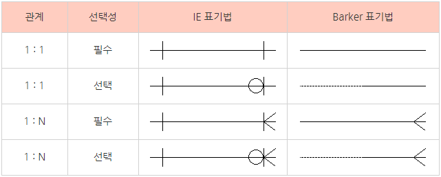
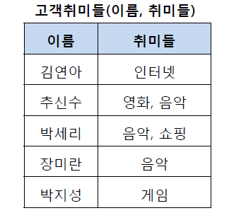
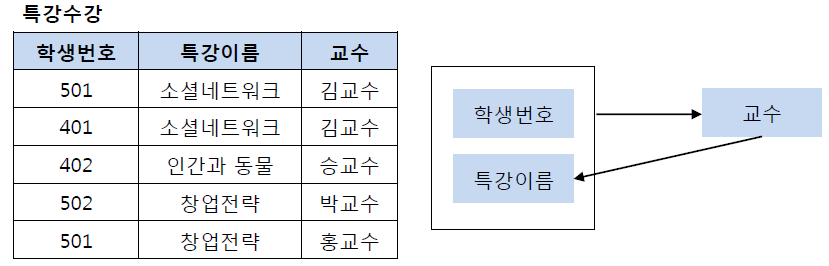

# CS Study - DB

빠른 이동
|<- 이전 | 현재 | 다음 ->|
|:---:|:---:|:---:|
|[데이터베이스의 기본](./db-transaction-&-integrity.md)|ERD와 정규화|[트랜잭션과 무결성](./db-transaction-&-integrity.md)|

## 2. ERD와 정규화

- ### ERD(Entity Relationship Diagram)

  테이블을 구성하는 개체들의 관계를 설명해주는 다이어그램

  

  각 표기법에 대한 자세한 설명은 링크 참조  
  [IE 표기법과 BARKER 표기법](https://mjn5027.tistory.com/42)  
    

- ### 정규화(Normalization)

  관계형 데이터베이스의 설계에서 중복을 최소화하게 데이터를 구조화하는 프로세스  
  데이터의 일관성(Consistency)과 모델의 응집도(Cohesion)를 높이는 것을 지향 함  
  테이블 간에 중복된 데이터를 허용하지 않아 무결성(Integrity)를 유지하고, DB의 저장 용량을 줄일 수 있음  
  정규화는 단계에 따라 제 1정규화, 제 2 정규화, 제 3정규화, BCNF 정규화로 나뉨
   

  **제 1 정규화**

  - 테이블의 컬럼이 원자값(Atomic Value, 하나의 값)을 갖도록 테이블을 분해
     

    Before  
    

    After  
    

  **제 2 정규화**

  - 제1 정규화를 진행한 테이블에 대해 완전 함수 종속을 만족하도록 테이블을 분해
  - 완전 함수 종속 : 기본키의 부분집합이 결정자가 되어선 안된다는 것  
     

    Before  
    

    After  
    

  **제 3 정규화**

  - 제2 정규화를 진행한 테이블에 대해 이행적 종속을 없애도록 테이블을 분해
  - 이행적 종속 : A -> B, B -> C가 성립할 때 A -> C가 성립  
     

    Before  
    

    After  
    

  **BCNF 정규화**

  - 제3 정규화를 진행한 테이블에 대해 모든 결정자가 후보키가 되도록 테이블을 분해
     

    Before  
    

    After  
    

- ### 역정규화Denormalization)

  정규화된 데이터베이스에서 성능을 개선하기 위해 사용되는 전략  
  정규화의 단점인 높은 데이터 조회비용을 개선하기 위해 DB를 재조정  
  Join이 너무 많아지는 DB 설계와 쿼리는 요청을 처리하는 시간을 증가시키는 문제가 있기 때문에 모든 주요 Entity를 분리하는 것이 좋은 것이 아니라 DB의 전반적인 성능을 향상시킬 수 있는 구조화 과정  
   
