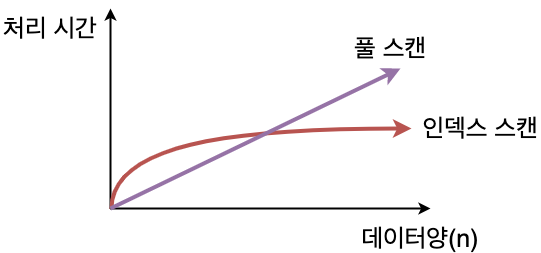

# CS Study - DB

빠른 이동
|<- 이전 | 현재 | 다음 ->|
|:---:|:---:|:---:|
|[DB의 종류](./db-rdbms-&-nosql.md)|인덱스|[힌트](!#)|

## 5. 인덱스

- ### 인덱스의 필요성

  테이블에 대한 동작속도를 높이는 기술  
  DB 조회 기능 성능을 높임 (Full Scan과 Table Scan을 감소시켜 성능 향상)  
  테이블의 컬럼의 색인화가 일어나서 인덱스를 관리하는 파일에서 따로 관리  
  <br/>

  ```text
  Full Scan : DB를 조회하기 위해서 테이블 전체 튜플을 조회하는 행위. 모든 튜플을 조회 하므로 O(N)의 시간 복잡도를 가지며 Join 같은 연산을 할때 연산량을 O(NM)으로 만든다.
  ```

  인덱스 사용의 장단점

  - 장점

    - 원하는 데이터를 찾기 위해 테이블을 검색하는 작업을 줄이거나 없앨 수 있음
    - 색인화된 인덱스 파일 검색으로 검색 속도를 향상  
      <br/>

    ```text
    색인화 : 특정 내용이 들어있는 정보를 쉽게 찾아볼 수 있도록 표지를 넣거나 일정한 순서에 따라 배열한 것
    ```

    <br/>

  - 단점

    - 테이블에 새로운 데이터를 추가하거나 갱신, 삭제가 자주 일어나면 좋지 않음
    - 테이블에 들어있는 데이터에만 변화가 있는 게 아니라 인덱스에도 추가, 갱신이 일어나기 때문에 오버헤드가 발생할 수 있음  
      <br/>

  인덱스를 사용하면 좋은 경우 (도입을 고려해야할 경우)

  - SELECT와 Join이 잦은 경우
  - 테이블의 데이터가 많은 경우
  - SELECT를 제외한 DML(=변경)이 잘 일어나지 않는 테이블  
    <br/>

- ### 인덱스 자료구조

  - 해시 테이블(Hash Table)

    - key와 value를 한 쌍으로 데이터를 저장하는 자료구조
    - key-value로 쌍을 표현하며, key값을 이용해 대응되는 value값을 구하는 방식
    - 해시 충돌이라는 변수가 존재하지만 평균적으로 O(1)의 시간안에 원하는 데이터를 탐색
    - 등호(=) 연산에 최적화되어 DB에서 자주 쓰는 부등호(<, >) 연산의 값을 빠르게 찾기 힘듬
    - 따라서 인덱스에 잘 사용하지 않는 사장된 방법  
      <br/>

  - B-Tree

    - 균형 트리(Balanced Tree)를 사용한 자료구조
    - 이진트리와 다르게 B-Tree는 자식노드의 최대숫자가 2보다 큼(키가 n개의 자식은 n+1개)
    - 한 노드에 n개의 자료가 배치되면 n차 B-Tree라고 한다.
    - 노드의 데이터는 반드시 정렬된 상태여야 한다.
    - 평균적으로 O(logN)의 시간안에 원하는 데이터를 탐색
        
      <br/>

  - B+tree

    - B-tree의 확장개념
    - B-tree의 경우, internal 또는 branch 노드에 key와 data를 담으나, B+tree의 경우 브랜치 노드에 key만 담아두고, data는 담지 않음
    - 오직 리프 노드에만 key와 data를 저장하고, 리프 노드끼리 Linked list로 연결됨
    - 리프 노드를 제외하고 데이터를 담아두지 않기 때문에 메모리를 확보해 더 많은 key들을 수용
    - 한 노드에 더 많은 key들을 담기에 트리의 높이는 더 낮아짐 (cache hit를 높일 수 있음)
    - Full scan 시, B-tree의 경우에는 모든 노드를 확인하지만 B+tree는 리프 노드에 데이터가 모두 있어 한 번의 선형탐색만 해서 빠름  
      <br/>

    ```text
    cache hit : 원하는 데이터가 캐시(또는 현재 적재된 데이터 메모리)안에 포함되어 있다면 cache hit라 하고, 아닐 경우 cache miss라 한다. cache hit 적중률이 높을 수록 데이터 탐색 정확도와 속도가 빠르다 할 수 있다.
    ```

      <br/>

  - InnoDB에서 사용된 B+tree

    

  - B-Tree와 B+Tree 비교

    비교표
    | 구분 | B-tree | B+tree |
    | --- | --- | --- |
    | 데이터 저장 | 리프 노드, 브랜치 노드 | 리프 노드 |
    | 트리의 높이 | 높음 | 낮음(한 노드 당 key를 많이 담을 수 있음) |
    | 검색 속도(Full scan) | 모든 노드 탐색 | 리프 노드에서 선형 탐색 |
    | 키 중복 | 없음 | 있음(리프 노드에 모든 데이터가 있기 때문) |
    | 검색 | 자주 access 되는 노드를 루트 노드 가까이 배치 <br/> 루트에 가까울 경우, 브랜치 노드에도 데이터가 존재하기 때문에 빠름 | 리프 노드까지 가야 데이터 존재 |
    | 링크드 리스트 | 없음 | 리프 노드끼리 링크드 리스트로 연결 |
