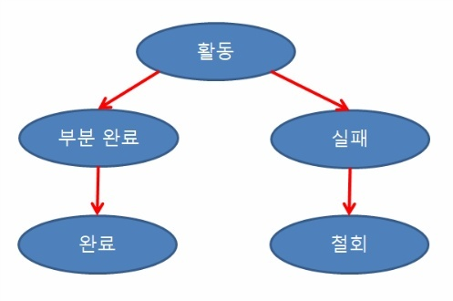

# CS Study - DB

빠른 이동
|<- 이전 | 현재 | 다음 ->|
|:---:|:---:|:---:|
|[ERD와 정규화](./db-erd-&-normalization.md)|트랜잭션과 무결성|[DB의 종류](./db-rdbms-&-nosql.md)|

## 3. 트랜잭션과 무결성

- ### 트랜잭션(Transaction)

  데이터베이스 시스템에서 병행 제어 및 회복 작업 시 처리되는 작업의 논리적 단위  
  사용자가 시스템에 대한 서비스 요구 시 시스템이 응답하기 위한 상태 변환 과정의 작업 단위  
  하나의 트랜잭션은 단위별로 Commit되거나 Rollback 함  
    

  트랜잭션의 특징(AICD)

  - Atomicity(원자성)

    - 트랜잭션의 연산은 DB에 모두 반영되든지 아니면 전혀 반영되지 않아야 함
    - 트랜잭션 내의 모든 명령은 반드시 완벽히 수행되어야 하며, 모두가 완벽히 수행되지 않고 어느하나라도 오류가 발생하면 트랜잭션 전부가 취소되어야 함  
       

  - Consistency(일관성)

    - 트랜잭션이 그 실행을 성공적으로 완료하면 언제나 일관성 있는 DB 상태로 변환
    - 시스템이 가지고 있는 고정요소는 트랜잭션 수행 전과 트랜잭션 수행 완료 후의 상태가 같아야 함  
       

  - Isolation(독립성,격리성)

    - 둘 이상의 트랜잭션이 동시에 병행 실행되는 경우 어느 하나의 트랜잭션 실행중에 다른 트랜잭션의 연산이 끼어들 수 없음
    - 수행중인 트랜잭션은 완전히 완료될 때까지 다른 트랜잭션에서 수행 결과를 참조할 수 없음  
       

  - Durablility(영속성,지속성)
    - 성공적으로 완료된 트랜잭션의 결과는 시스템이 고장나더라도 영구적으로 반영되어야 함  
       

  트랜잭션 연산

  - Commit연산

    - Commit 연산은 한개의 논리적 단위(트랜잭션)에 대한 작업이 성공적으로 끝났고 데이터베이스가 다시 일관된 상태에 있을 때 사용
    - 이 트랜잭션이 행한 갱신 연산이 완료된 것을 트랜잭션 관리자에게 알려주는 연산  
       

  - Rollback연산

    - Rollback 연산은 하나의 트랜잭션 처리가 비정상적으로 종료되어 데이터베이스의 일관성을 깨뜨렸을 때 사용
    - 이 트랜잭션의 일부가 정상적으로 처리되었더라도 트랜잭션의 원자성을 구현하기 위해 이 트랜잭션이 행한 모든 연산을 취소(Undo)하는 연산
    - Rollback시에는 해당 트랜잭션을 재시작하거나 폐기 함  
       

  트랜잭션 상태

  

  - 활동(Active) : 트랜잭션이 실행 중인 상태
  - 실패(Failed) : 트랜잭션에 오류가 발생하여 중단된 상태
  - 철회(Aborted) : 트랜잭션이 비정상적으로 종료되어 Rollback 연산을 수행한 상태
  - 부분 완료(Partially Committed) : 트랜잭션의 마지막 연산까지 실행했지만, Commit 연산이 실행되기 직전의 상태
  - 완료(Committed) : 트랜잭션이 성공적으로 종료되어 Commit 연산을 실행한 후의 상태  
      

- ### 무결성(Integrity)

  데이터 무결성은 데이터의 정확성, 일관성, 유효성을 유지하는 것

  - 정확성 : 중복이나 누락이 없는 상태
  - 일관성 : 원인과 결과의 의미가 연속적으로 보장되어 변하지 않는 상태
  - 유효성 : 요구하는 규격에 맞게 입력되는 상태  
     

  무결성을 유지하는 이유

  - 데이터에 대한 신뢰도 충족
  - 제약조건을 사용하면 데이터를 실생활의 의미에 맞게 사용할 수 있음
  - 응용 프로그램에서 조건을 유지하는 경우보다 에러가 발생율을 낮춤
  - 스키마를 작성 시 무결성 제약조건을 한 번만 명시하면, 데이터베이스가 갱신될 때마다 DBMS가 자동으로 제약조건을 검사하므로 어플리케이션들은 제약조건을 일일이 검사할 필요 없음  
     

  데이터 무결성 종류와 개념

  1. 개체 무결성(Entity integrity)

     기본 키 제약이라고도 하며, 테이블은 기본키를 지정하고 그에 따른 무결성 원칙을 지켜야 하는 조건

     - 기본 키(Primary Key)에는 Null 값이 올 수 없음
     - 기본 키는 테이블 내에 오직 하나의 값만 존재해야 함  
        

  2. 참조 무결성(Referential integrity)

     외래 키 제약이라고도 하며, 테이블 간의 참조 관계를 선언하는 제약조건

     - 외래 키(Foreign Key)의 값은 Null이거나 참조 릴레이션의 기본키 값과 동일해야 함
     - 외래 키 속성은 참조할 수 없는 값을 지닐 수 없음  
        

  3. 도메인 무결성(Domain integrity)

     테이블에 존재하는 필드의 무결성을 보장하기 위한 것으로 필드의 타입, Null 값 허용 등에 대한 사항을 정의하고 올바른 데이터가 입력되었는지 확인하는 조건  
      

  4. Null무결성(Null integrity)

     테이블의 특정 속성 값이 Null이 될 수 없게 하는 조건  
      

  5. 고유 무결성 (Unique integrity)

     테이블의 특정 속성에 대해 각 레코드들이 갖는 값들이 서로 달라야 하는 조건  
      

  6. 키 무결성 (Key integrity)

     하나의 테이블에는 적어도 하나의 키가 존재해야 하는 조건  
      

  7. 관계 무결성 (Relationship integrity)

     테이블의 어느 한 레코드의 삽입 가능 여부 또는 한 테이블과 다른 테이블의 레코드들 사이의 관계에 대한 적절성 여부를 지정한 조건  
      
