# Network

## 📔 네트워크와 모델

### 1. 네트워크, 인터넷, 프로토콜의 개념을 설명해주세요.

✔️ **네트워크** 

- 컴퓨터 등의 **장치**들이 통신 기술을 이용하여 구축하는 **연결망**을 지칭하는 용어

✔️ **인터넷** 

- 컴퓨터로 연결하여 TCP/IP(Transmission Control Protocol/Internet Protocol)라는 통신 프로토콜
을 이용해 정보를 주고받는 컴퓨터 네트워크
- '~간의'를 의미하는 `inter`와 '네트워크'의 `net`을 합성한 단어
- 인터넷도 '네트워크 간의'를 의미하며 네트워크와 네트워크를 연결한다는 의미로 쓰임.
- 즉, **네트워크간의 연결**, **네트워크의 네트워크**라는 뜻을 지니고 있음.

✔️ **프로토콜**

- 컴퓨터나 원거리 통신 장비 사이에서 메시지를 주고 받는 양식과 **규칙**의 체계

### 2. 네트워크 통신방식 3가지를 설명하고 해당 통신방식에 속하는 예시를 하나 설명해주세요.

**<전송 방향에 따른 통신 방식>**

- **단방향 통신** ( `**Simplex**` )
    - **송신측과 수신측이 미리 고정**
    - 데이터가 **한쪽 방향으로만 전송**되는 통신 방식
    - **ex) 라디오**, **아날로그 TV**, **모니터**, **키보드**
- **양방향 통신** ( Duflex )
    - `**반이중 통신(Half-Duflex)` :** 양쪽 방향에서 통신이 가능하지만 **동시에는 통신이 불가능 ex) 무전기**
    - `**전이중 통신(Full-Duflex)` :** 양쪽 방향에서 **동시에 같이 주고 받을 수 있음. ex) 전화기**
    

**<LAN에서 통신하는 방식>**

- **유니캐스트** ( Unicast )
    
    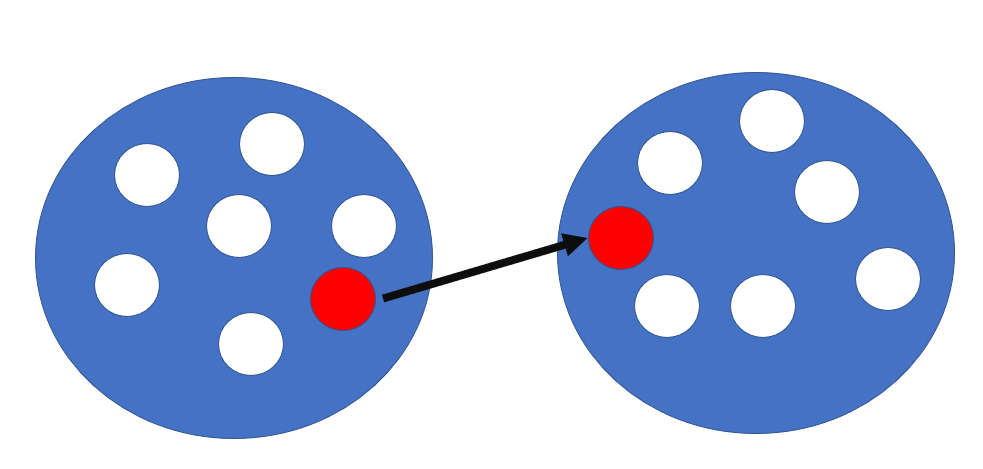
    
    - 고유 주소로 식별된 하나의 네트워크 목적지에 1:1로 데이터를 전송하는 방식
    - 받는 입장에서 자신의 MAC과 비교하여 동일하지 않으면 해당 통신을 받지 않기 때문에 CPU 성능을 저하시키지 않음.
- **브로드캐스트** ( Broadcast )
    
    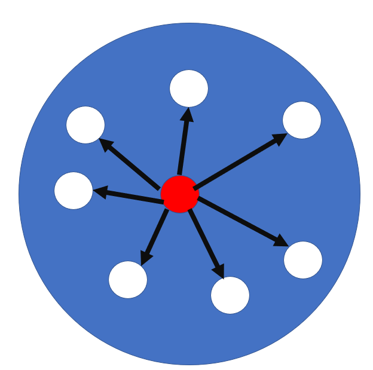
    
    - 같은 네트워크에 있는 모든 장비들에게 보내는 통신
    - 아파트 관리 사무소 방송처럼 해당 네트워크에 있는 PC들이 신호를 받고 싶던 말던 무조건 받게 됨.
    - 주로 상대 IP는 알지만 MAC을 모를 경우에 사용함.
- **멀티캐스트** ( Multicast )
    
    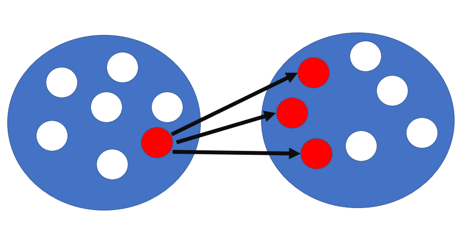
    
    - 같은 데이터를 특정 그룹에게 보내주어야 할 때 사용하는 인터넷 프로토콜 ex) TV
    - 유니캐스트 + 브로드캐스트를 합쳐놓은 듯한 개념.
- 애니캐스트 (Anycast)
    - 가장 가까운 Node와 통신하는 방식
    

### 3. 네트워크 모델 2가지를 설명하고 두 모델의 공통점과 차이점을 설명해주세요.

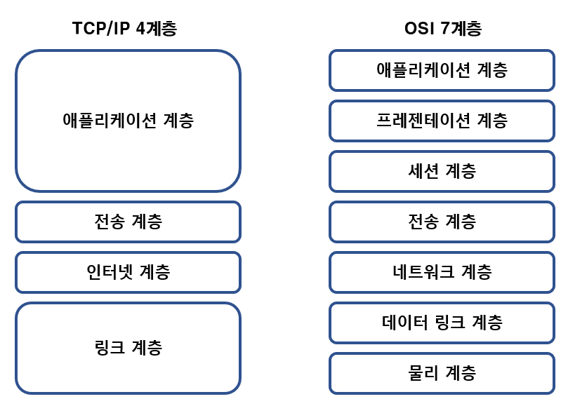

✔️ **OSI 7계층**

- ISO(국제 표준화 기구) 제안한 **7계층의 모델**로서, 추상적인 모델
- **물리계층**
    - **물리적 매체**를 통한 비트 전송에 요구되는 기능을 담당
    - 통신 단위 : `**비트(bit)**`
    - `**통신 케이블**`, `**허브**`
- **데이터 링트 계층**
    - **노드 대 노드(node-to-node)** 전달의 책임을 가지는 계층
    - 송신자와 수신자의 **MAC address** 를 **헤더에 추가**하며, **오류 제어 및 흐름 제어**를 수행
    - 통신 단위 : `**프레임(Frame)**`
    - 장치 : `**브릿지**`, `**스위치**`
    - 프로토콜 : `**이더넷**`
- **네트워크 계층**
    - **발신지 대 목적지** 전달에 대한 책임을 가지는 계층
    - 전송 계층에서 받은 패킷에 발신지와 목적지의 **IP address** 를 헤더에 추가
    - 패킷이 최종 목적지에 전달될 수 있도록 경로를 지정하거나 교환하는 **라우팅 기능**을 수행
    - **`라우터`**
- **전송 계층**
    - 개별적인 패킷의 **종단 대 종단(End-to-End)** 전송을 담당하는 계층
    - 포트 주소를 지정하며, 세그먼트로의 캡슐화를 수행
- **세션 계층**
    - 통신 시스템과 사용자간의 연결을 유지 및 설정하는 계층
    - `**동기화**`, `**대화 제어**`, `**세션 관리**`
- **프레젠테이션 계층(표현 계층)**
    - 두 시스템간 주고 받는 정보의 **구문(Syntax)** 과 **의미(Semantic)** 와 관련된 계층
    - 통신 장치 간의 상호 운용성을 보장
    - 보안 목적을 위한 데이터 암호화 및 복호화
    - 데이터 압축 및 확장
- **애플리케이션 계층(응용 계층)**
    - **가장 유저와 가까운 층**으로서, 사용자가 네트워크에 접근할 수 있도록 서비스를 제공하는 계층
    - **사용자 인터페이스 제공**
    - `**파일 전송**`, `**우편 서비스**`, **`웹 접근`**

✔️ **TCP/IP 4계층**

- **링크 계층(Network Access Layer라고도 함)**
    - 전선, 광섬유, 무선 등 실질적으로 데이터를 전달하며 장치 간에 신호를 주고받는 규칙을 정하는 계층
    - 물리적인 MAC주소가 해당됨.
    - 전송 단위 : Frame
    - 프로토콜 : Ethernet, Token, Ring, PPP
- **인터넷 계층**
    - 장치로부터 받은 네트워크 패킷을 IP 주소로 지정된 목적지로 전송하기 위해 사용되는 계층
    - 패킷을 수신해야 할 상대의 **주소를 지정**하여 데이터를 전달
    - 프로토콜 : IP, ARP, ICMP
    - **비연결형** : 상대방이 제대로 받았는지를 보장하지 않음.
- **전송 계층**
    - 송신자와 수신자를 연결하는 **통신 서비스**를 제공
    - **연결 지향 데이터 스트림 지원**, **신뢰성**, **흐름 제어** 제공
    - 프로토콜 : TCP, UDP
    - `**TCP(Transmission Control Protocol)**`
        - 패킷 사이의 **순서를 보장**
        - **연결지향** 프로토콜을 사용해서 연결을 하여 **신뢰성**을 구축하여 수신 여부 확인
        - **가상회선 패킷 교환 방식** 사용 : 각 패킷에는 **가상회선 식별자**가 포함되며 모든 패킷을 전송하면 가상회선이 해제되고 패킷들은 **전송된 순서대로** 도착하는 방식
        - TCP 연결 성립 과정 : **3-way handshake**
        - TCP 연결 해제 과정 : **4-way handshake**
    
    ```
    SYN : SYNchronization의 약자, **연결 요청** 플래그
    ACK : ACKnowledgement의 약자, **응답** 플래그
    ISN : Initial Sequence Numbers의 약어, 초기 네트워크 연결을 할 때 할당된 32비트 고유 시퀀스 번호
    ```
    
    ```
    <3-way handshake>
    1. SYN 단계 : 클라이언트는 서버에 클라이언트의 ISN을 담아 SYN을 보냄
    * ISN : 새로운 TCP 연결의 첫 번째 패킷에 할당된 임의의 시퀀스 번호
    2. SYN + ACK 단계 : 서버는 클라이언트의 SYN을 수신, 서버의 ISN을 보내며 승인 번호로 클라이언트의 ISN+1를 보냄
    3. ACK 단계 : 클라이언트는 서버의 ISN + 1한 값인 승인번호를 담아 ACK를 서버에 보냄.
    
    * 이 과정이 있기 때문에 신뢰성이 있는 계층이라고 함.
    UDP는 이 과정이 없기 때문에 신뢰성이 없는 계층
    ```
    
    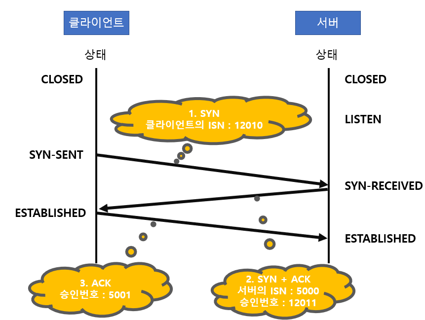
    
    ```
    <4-way handshake>
    1. 클라이언트가 연결을 닫으려고 할 때 FIN으로 설정된 세그먼트를 보내고 클라이언트는 FIN_WAIT_1 상태로 들어가고 서버의 응답을 기다림.
    2. 서버는 ACK라는 승인 세그먼트를 보냄. 그리고 COLSE_WAIT 상태에 들어가고, 클라이언트는 세그먼트를 받으면 FIN_WAIT_2상태에 들어감.
    3. 서버는 일정 시간 후에 FIN이라는 세그먼트를 보냄.
    4. 클라이언트는 TIME_WAIT 상태가 되고 다시 서버로 ACK를 보내서 서버는 CLOSED 상태가 됨.
    이후 클라이언트는 어느 정도의 시간을 대기한 후 연결이 닫히고 클라이언트와 서버의 모든 자원의 연결이 해제됨.
    
    ```
    
    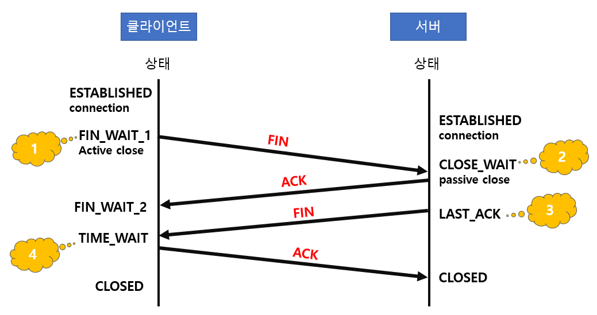
    
    - `**UDP(User Datagram Protocol)**`
        - **순서를 보장하지 않고** 수신 여부를 확인하지 않음.
        - **데이터그램 패킷 교환 방식** 사용
        - **데이터그램 패킷 교환 방식** : **패킷이** 독립적으로 이동하며 최적의 경로를 선택하여 가는데, 하나의 메시지에서 분할된 여러 패킷은 서로 다른 경로로 전송될 수 있으며 도착한 **순서가 다를 수 있는 방식**을 뜻함. → **단순히 데이터만** 줌.
- **애플리케이션 계층**
    - 사용자가 네트워크에 접근할 수 있도록 서비스를 제공하는 계층
    - 프로토콜 : FTP, HTTP, SSH, SMTP, DNS 등
    - `**FTP(File Transfer Protocol)**` : 장치와 장치 간의 **파일을 전송**하는데 사용되는 표준 통신 프로토콜
    - `**SSH(Secure Shell)**` : 보안되지 않은 네트워크에서 네트워크 서비스를 안전하게 운영하기 위한 **암호화** 네트워크 프로토콜
    - `**HTTP(HyperText Transfer Protocol)**` : World Wide Web을 위한 데이터 통신의 기초이자 **웹 사이트**를 이용하는 데 쓰는 프로토콜
    - `**SMTP(Simple Mail Transfer Protocol)**` : **전자 메일 전송**을 위한 인터넷 표준 통신 프로토콜
    - `**DNS(Domain Name System)**` : **도메인 이름과 IP주소를 매핑**해주는 서버, 예를 들어 www.naver.com의 IP주소가 222.111.222.111에서 222.111.222.122로 바뀌어도 www.naver.com이라는 주소로 서비스가 가능하게 해주는 것.

**✔️ OSI, TCP/IP 공통점**

- 계층형

**✔️ OSI, TCP/IP 차이점**

- **`OIS`** - **개념적 모델**로 통신에는 실질적으로 사용되지 않음. 즉, 통신 모델 표준을 정할 때 주로 사용됨.
- **`TCP/IP`** - **실질적**인 통신에 **주로 사용**됨.

## 📔 데이터 통신

### 1. Ethernet에 대해 설명하세요.

❓ 네트워킹의 한 방식으로 **LAN, WAN등의 네트워크 환경**에서 각 기기들이 **전송매체를 통해 데이터를 주고받을 수 있도록 만들어진 기술**

- 사용 프로토콜 : **`CSMA/CD`**
- CSMA/CD(Carrier Sense Multiple Access/Collision Detection)
    - 호스트가 **채널의 상태를 감지**하여 **충돌을 회피**하는 네트워킹 방식
    - Carrier 감지되지 않으면 자신의 데이터를 네트워크에 전송
- OSI모델의 물리 계층에서 신호와 배선, 데이터 링크 계층에서 MAC(Media Access Control) 패킷과 프로토콜의 형식을 정의함.
- 이더넷 기술은 대부분 **`IEEE 802.3`** 규약으로 표준화됨.

 ✔️ **장점** : 설치 비용이 **저렴**하고 **관리가 쉽**고 네트워크 **구조**가 **단순**

✔️ **단점** : 네트워크 사용시 신호 때문에 **충돌 발생** → **지연 발생**, 시스템의 **부하가 증가**하면 **충돌도 계속 증가**

✔️ **이더넷 프레임의 구조**

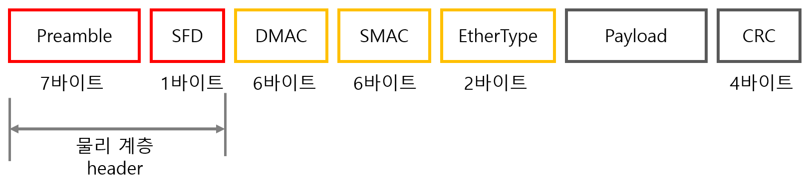

- **Preamble** : 이더넷 프레임이 시작임을 알림.
- **SFD(Start Frame Delimiter)** : 다음 바이트부터 MAC 주소 필드가 시작됨을 알림.
- **DMAC, SMAC** : 수신, 송신 MAC 주소를 말함.
- **EtherType** : 데이터 계층 위의 계층인 IP 프로토콜을 정의 ex) IPv4 또는 IPv6가 됨.
- **Payload** : 전달받은 데이터
- **CRC** : 에러 확인 비트

### 2. LAN에 대해 설명하세요.

❓ **LAN(Local Area Network)**

- **근거리 통신망**으로 학교, 회사, 연구소 등 한 건물이나 **일정 지역 내**에서 컴퓨터나 단말기들을 **고속 전송 회선**으로 **연결**하여 프로그램 파일 또는 주변 장치를 공유할 수 있도록 한 네트워크 형태

✔️ **특징**

- 제한된 지역 내의 통신
- 공유 매체를 사용하므로 경로 선택 없이 매체에 연결된 모든 장치로 데이터를 전송
- 다른 기종 간의 통신에서 사무 처리의 능률화가 극대화됨.
- 네트워크의 확장이나 재배치가 쉬움.
- 전송 매체 : 꼬임선, 동축 케이블, 광섬유 등
- 망의 구성 형태 : **계층형**, **버스형**, **성형**, **링형**, **메쉬형**
- `**계층형(Tree Topology)**`
    
    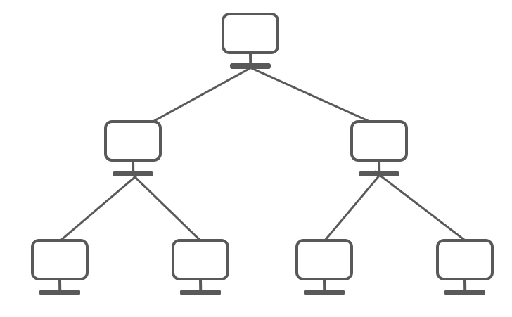
    
    - **트리 형태**로 배치한 네트워크 구성
    - 노드의 추가, 삭제가 쉬움.
    - 특정 노드에 트래픽이 집중될 때 하위 노드에 영향을 끼칠 수 있음.
- `**버스형(Bus Topology)**`
    
    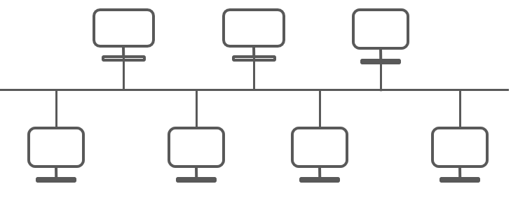
    
    - **중앙 통신 회선 하나에 여러 개의 노드가 연결**되어 공유하는 네트워크 구성
    - 설치 비용이 적고 신뢰성이 우수, 중앙 통신 회선에 노드 추가, 삭제가 쉬움.
    - 문제점 : 스푸핑 가능
    - 스푸핑 : 송신과 관련 없는 다른 호스트에 가지 않도록 하는 스위칭 기능을 마비시키거나 속여서 특정 노드(악의적인 노드)에 해당 패킷이 오도록 처리하는 것.
- `**성형(Star Topology)**`
    
    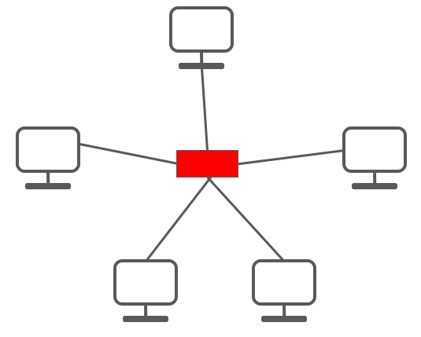
    
    - **중앙에 있는 노드에 모두 연결**된 네트워크 구성
    - 노드를 추가하거나 에러 탐지가 쉬움.
    - 패킷의 충돌 발생 가능성이 적음.
    - 장애 노드가 중앙 노드가 아닐 경우 다른 노드에 영향을 끼치는 것이 적음.
    - 중앙 노드에 장애가 발생하면 전체 네트워크 사용 불가
    - 설치 비용이 고가
- `**링형(Ring Topology)**`
    
    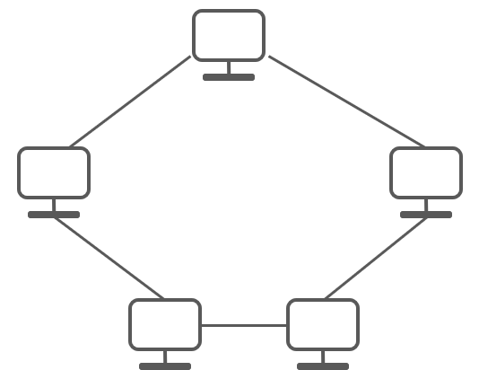
    
    - 각각의 노드가 양 옆의 두 노드와 연결하여 전체적으로 **고리처럼 하나의 연속된 길**을 통해 통신을 하는 구성 방식
    - 데이터는 노드에서 노드로 이동
    - 각각의 노드는 고리 모양의 길을 통해 패킷 처리
    - 노드 수가 증가되어도 네트워크상의 손실이 거의 없고 충돌이 발생될 가능성이 적고 노드의 고장 발견이 쉬움.
    - 네트워크 구성 변경이 어려움.
    - 회선에 장애가 발생하면 전체 네트워크에 영향을 끼침.
- `**메쉬형(Mesh Topology)**`
    
    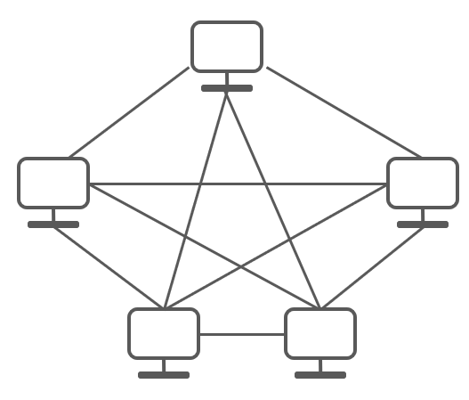
    
    - 망형 토폴로지라고도 하며 **그물망처럼 연결**되어 있는 구조
    - 한 단말 장치에 장애가 발생해도 여러 개의 경로가 존재하므로 네트워크를 계속 사용할 수 있음.
    - 트래픽도 분산 처리가 가능
    - 노드 추가가 어려움.
    - 구축 비용과 운용 비용이 고가임.

### 3. 데이터 링크 계층의 역할에 대해 설명하세요.

- **인접한 네트워크 노드**들끼리 **데이터를 전송**하는 역할
- **물리 계층에서 발생하는 오류를 감지**하고 수정하는 역할
- 송신자와 수신자의 **MAC address** 를 **헤더에 추가**하며, **오류 제어 및 흐름 제어**를 수행
- 통신 단위 : `**프레임(Frame)**`
- 장치 : `**브릿지**`, `**스위치**`
- 프로토콜 : `이더넷`

## 📔 IP 주소

### 1. 공인 IP와 사설 IP의 차이에 대해서 설명해주세요.

|  | 공인 IP | 사설 IP |
| --- | --- | --- |
| 할당 주체 | ISP(인터넷 서비스 공급자) | 라우터(공유기) |
| 할당 대상  | 개인 또는 회사의 서버(라우터) | 개인 또는 회사의 기기 |
| 고유성 | 인터넷 상에서 유일한 주소 | 하나의 네트워크 안에서 유일 |
| 공개 여부 | 내/외부 접근 가능 | 외부 접근 불가능 |

### 2. IPv4 와 IPv6의 차이는?

|  | IPv4 | IPv6 |
| --- | --- | --- |
| 주소 길이 | 32 bit | 128 bit |
| 표시 방법 | 8 bit 씩 4부분으로 나눠 10진수로 표시 
202.30.63.33 | 16 bit 씩 8부분으로 나눠 16진수로 표시
2001:230:abcd:ffff:0000:0000:ffff:1111 |
| 주소 할당 | 약 43억개 | 거의 무한대 |
| 품질 제어 | 품질 보장 곤란 | 등급/ 서비스 별로 패킷을 구분할 수 있어 품질 보장 용이 |
- **8비트를 이진수로 표현하면 11111111 최대 값**인데 이걸 **10진수**로 표현하면 **255**가 됨.

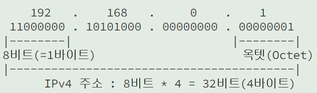

### 3. IP 주소 클래스에 대해서 설명해주세요.

**`IP 주소 = 네트워크 주소 + 호스트 주소`**

- **네트워크 주소** : **호스트(단말)들을 모은 네트워크를 지칭하는 주소를 뜻함.** 네트워크 주소가 동일한 네트워크를 로컬 네트워크라고 함.
- **호스트 주소** : **하나의 네트워크 내에 존재하는 호스트(단말)를 구분하기 위한 주소**
- IP 주소에서 네트워크 주소와 호스트 주소를 구분하기 위해 클래스라는 개념이 도입
    
    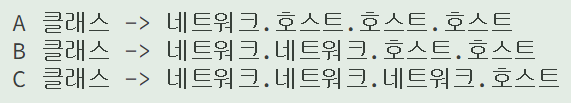
    
    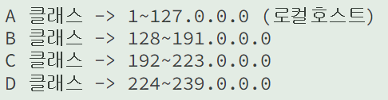
    
- D 클래스 : 브로드캐스트용 주소
- E 클래스 : 예비용 주소

### 4. 서브넷 마스크에 대해서 설명해주세요.

❓  IP Address에서 **네트워크 주소와 호스트 주소를 구분**하기 위한 구분자

- 클래스 기반보다 **네트워크 주소를 세밀하게 분할하고 할당**하기 위해서 네트워크 크기에 맞춰 **1비트 단위로 네트워크를 상세히 분할**하는 방법을 사용 → **클래스 리스**
- **클래스 리스에서 사용하는 구분자**가 서브넷 마스크
- **1은 네트워크 주소, 0은 호스트 주소**

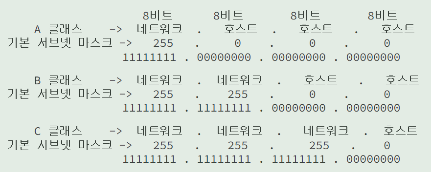

## 📔 ARP 프로토콜

### 1. ARP 프로토콜 동작 흐름에 대해 설명해주세요. (ARP 프로토콜에 대해 설명해주세요.)

❓ ARP(Address Resolution Protocol) : 네트워크 상에서 **논리적(IP 주소)를 물리적 주소(MAC Address)로 변환**해주는 ****프로토콜

- **LAN에서 사용**하는 Protocol

✔️ **동작 흐름**

1. 장치 A가 목적지의 MAC주소를 찾기 위해 **ARP Request 브로드 캐스트를 보냄**. → 목적지의 물리주소를 모르기 때문에 브로드 캐스트로 보냄.
2. 메시지는 2계층으로 전달되고 이더넷 프레임으로 Encapsulation됨. → 송신자 물리 주소를 발신지 주소, 수신자 물리 주소를 브로드 캐스트 주소로 지정
3. 목적지 주소와 일치하는 **장치 B**가 자신의 물리 주소를 포함하고 있는 **ARP Reply 유니 캐스트를 보냄**→ 목적지를 알기 때문에 유니 캐스트로 보냄.

### 2. ARP와 RARP를 비교해서 설명해주세요.

**ARP** : 가상 주소인 **IP 주소를** 실제 주소인 **MAC 주소로 변환**

**RARP** : 실제 주소인 **MAC 주소를** 가상 주소인 **IP 주소로 변환**

## 📔 IPv4, ICMP 프로토콜

### 1. IPv4가 하는일과 IPv4 프로토콜 구조를 설명해주세요.

IPv4 : 기본적으로 패킷 교환 네트워크 **(Packet Switching Network)** 환경에서 사용되며 데이터를 교환하기 위한 하나의 **프로토콜**

✔️ IPv4 프로토콜 구조

???? 이해가 안됨.

### 2. ICMP가 하는일과 ICMP 프로토콜 구조를 설명해주세요.

❓ Internet Control Message Protocol은 **여러 정보를 전달**하거나 **컨트롤**하는 용도로 사용되는 프로토콜

- **네트워크 계층**에서 사용됨.

✔️ **용도**

- **에러 알림** : 패킷 전송이 실패했을 때 에러가 났음을 알림과 동시에 해결 가능한 힌트를 제공
- **진단 / 정보 전달 메세지** : ping, traceroute 명령 등등 진단과 정보 전달을 하는 데에 사용

✔️ **ICMP 프로토콜 구조**

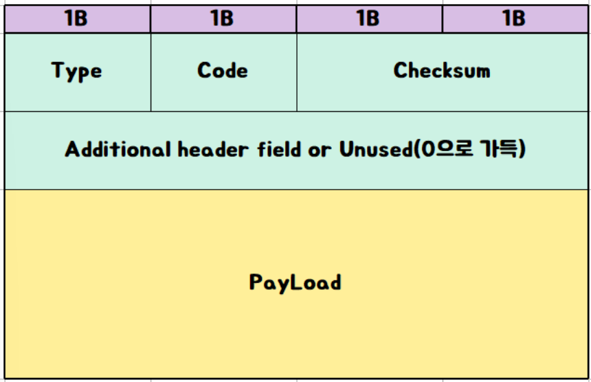

- **`Type`** : ICMP **패킷의 종류**를 의미
- `**Code**` : **Type**을 좀 더 자세히 **분류**
- `**Checksum**` : 코드에 **오류**가 없는지 **확인**하는 용도
- `**Additional header field**` : Type에 따라 쓸 수도 있고, 안 쓸 수도 있는 부분, 사용하지 않으면 0으로 차 있음.
- `**PayLoad**` : 직접적인 **데이터** 내용

### 3. 다른 네트워크까지 내 패킷의 이동 과정을 설명해주세요.

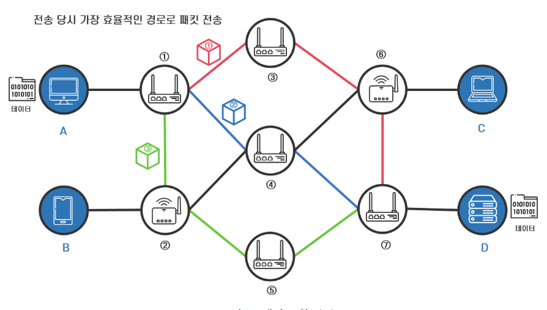

✔️ 패킷 송신

1. 송신 호스트 A가 수신 호스트 D로 전송한 패킷은 중간 노드인 라우터의 라우팅에 따라 
2. **패킷 ①**은 **`노드 1 ⇒ 노드 3 ⇒ 노드 6 ⇒ 노드 7`**의 경로로,
3.  **패킷 ②**는 `**노드 1 ⇒ 노드 4 ⇒ 노드 7**`의 경로로, 
4. **패킷 ③**은 `**노드 1 ⇒ 노드 2 ⇒ 노드 5 ⇒ 노드 7**`의 경로로 전송될 수 있음.
- 송신 호스트가 전송한 각 패킷들은 서로 독립적인 라우팅 과정을 거쳐 수신 호스트에 도착하기 때문에 패킷마다 전송에 걸리는 시간이 다르게 출발한 순서와 무관하게 수신 호스트에 도착
- 즉, 패킷 간 전송 순서가 보장되지 않기 때문에 수신지 호스트에서는 송신지 호스트가 전송한 패킷이 모두 도착하면 프로토콜을 사용하여 패킷 헤더를 읽고 패킷의 순서를 다시 정리해서 원래의 데이터로 패킷을 재결합
- 수신지 호스트 D는 패킷 ①, ②, ③을 전부 수신하면, 패킷 ②, ①, ③의 순서로 도착했더라도 패킷 ①, ②, ③의 순서로 정리한 후 원래의 데이터로 재결합

## 📔 전송계층 및 포트

### 1. Port란 무엇인가요?

❓ 네트워크 상에서 특정 PC를 나타내는 **IP주소에 진입할 수 있는 정해진 통로**

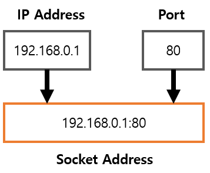

**✔️ 포트 번호**

- 대부분의 경우 하나의 컴퓨터에는 **여러 개의 서버**가 실행되는데 이 **중 어느 서버에 접속해야 하는지 컴퓨터에게 알려줄** 때 사용되는 것.
- 컴퓨터에서 실행되고 있는 **서버를 구분 짓기 위한 16비트의 논리적 할당**
- 0~65536번이 존재

### 2. 서버 측에서 사용되는 포트는 이미 정해져 있습니다. 주요 Well-Known Port에 대해 아는대로 설명해주세요.

**✔️ Well-Kown Port**

- 0~65536번의 포트 중 **어떤 통신이 해당 포트를 사용할 것인지** 정해둔 포트
- `**0~1023번**`이 해당됨.
- **20번 포트** : **FTP data** **프로토콜**
    - 파일 전송 프로토콜, **데이터 포트**, **FTP는 두 개의 포트 사용**
- **21번 포트 : FTP 프로토콜**
    - **PUT, GET 등의 FTP 명령을 전송하는데 사용**
- **22번 포트 : SSH 프로토콜**
    - **암호화된 원격 로그인에 사용**
- **80번 포트 : HTTP 프로토콜, 웹서버 - www 기반의 프로토콜**
    - **http://www.naver.com**에 **접속하면 80번 포트에 연결**
    - 일반적으로 **`http://www.naver.com:80`**에서 `**:80**`은 생략
- **443번 포트 : HTTPS 프로토콜**
    - HTTP over SSL 암호화된 전송
- 컴퓨터에 있는 웹서버는 기본적으로 80번 포트에 연결되어 있는데 **웹서버를 하나 더 사용하고 싶은 경우** well-known port가 아닌 다른 포트를 사용 → **보통 8080포트** **사용**

### 3. 클라이언트와 서버의 통신 과정에 대해 설명해주세요.

1. 사용자가 웹 브라우저에 URL **주소 입력**
2. 웹 브라우저(**클라이언트**)는 **DNS 서버에** URL주소의 호스트 이름을 전송하여 **웹 서버의 IP 주소를 요청**
3. DNS 서버는 해당 웹 서버의 **IP 주소를 반환**
4. **웹 브라우저**는 DNS로부터 받은 IP 주소와 80번 포트를 사용하여 웹 서버와 TCP연결을 시도하고 화면의 내용을 얻기 위한 **GET 명령**을 전송(**HTTP 요청 메세지**)
5. **서버**는 클라이언트의 **요청을 승인**하고 **200 메세지**를 클라이언트에게 전송하고 웹 사이트의 파일들을 **데이터 패킷**이라 불리는 작은 일련의 덩어리들로 **브라우저에 전송** 시작
6. **전송 완료되면** 웹 브라우저와 서버 사이의 **TCP 연결 해제**
7. **브라우저가** 작은 데이터 패킷을 완전한 **웹 사이트**로 조립하고 **사용자에게 보여줌.**

## 📔 UDP 비연결지향형

### 1. UDP 서버의 특징에 대해서 설명하세요.

- **연결 없이 통신이 가능**
- **순서를 보장하지 않고** 수신 여부를 확인하지 않음.
- 즉 보내는 쪽에서 일방적으로 데이터 전송
- 정보를 주고 받을때 정보를 보내거나 받는다는 **신호절차를 거치지 않음**. → 따라서 **신뢰성이 없다**고 말함.
- 패킷 관리가 필요
- 상대적으로 TCP보다 전송 속도가 빠름.
- **데이터그램 패킷 교환 방식** 사용
- **데이터그램 패킷 교환 방식** : **패킷이** 독립적으로 이동하며 최적의 경로를 선택하여 가는데, 하나의 메시지에서 분할된 여러 패킷은 서로 다른 경로로 전송될 수 있으며 도착한 **순서가 다를 수 있는 방식**을 뜻함. → **단순히 데이터만** 줌.

### 2. UDP는 어느 상황에서 사용하는지 설명하세요.

✔️ **실시간으로 데이터가 오고 가는 서비스**에서 많이 사용

- **멀티미디어 스트리밍** 애플리케이션
- **인터넷 전화** 애플리케이션
- **온라인 게임**

## 📔 TCP 연결지향형

### 1. TCP 프로토콜의 특징을 UDP 프로토콜과 비교하여 설명해주세요.

**✔️ OSI, TCP/IP 차이점**

- **`OSI`** - **개념적 모델**로 통신에는 실질적으로 사용되지 않음. 즉, 통신 모델 표준을 정할 때 주로 사용됨.
- **`TCP/IP`** - **실질적**인 통신에 **주로 사용**됨.

### 2. 3-way handshake에 대해 설명해주세요.

✔️ **3-way handshake** : 3단계를 거쳐서 **TCP 연결 성립**되는 과정

```
<3-way handshake>
1. SYN 단계 : 클라이언트는 서버에 클라이언트의 ISN을 담아 SYN을 보냄
* ISN : 새로운 TCP 연결의 첫 번째 패킷에 할당된 임의의 시퀀스 번호
2. SYN + ACK 단계 : 서버는 클라이언트의 SYN을 수신, 서버의 ISN을 보내며 승인 번호로 클라이언트의 ISN+1를 보냄
3. ACK 단계 : 클라이언트는 서버의 ISN + 1한 값인 승인번호를 담아 ACK를 서버에 보냄.

* 이 과정이 있기 때문에 신뢰성이 있는 계층이라고 함.
UDP는 이 과정이 없기 때문에 신뢰성이 없는 계층
```


### 3. 3-way handshake에서 클라이언트가 서버가 보낸 ACK+SYC을 받지 못하면 어떻게 되나요?

- 클라이언트와 서버 둘 다 응답을 계속 기다리다가 서버 쪽에서 이 연결을 **백로드 큐**(메모리 공간)에 **저장**하여 기다리고 있다가 **일정 시간 동안 응답이 안 오면 연결을 초기화**함.
- 이런 취약점을 이용해 SYN Flooding이라는 공격을 하는 경우가 있음.
- **SYN Flooding** : 존재하지 않는 클라이언트 IP로 응답이 없는 연결을 초기화 하기 전에 1단계 요청만 무수히 많이 보내 백로그 큐를 포화 상태로 만들어 다른 사용자가 연결 요청을 못하게 하는 공격 방법

### 4. 4-way handshake에서 서버가 마지막에 FIN을 보내는 이유는 무엇인가요?

✔️ **4-way handshake** : 4단계를 거쳐서 **TCP 연결 해제**되는 과정

```
<4-way handshake>
1. 클라이언트가 연결을 닫으려고 할 때 FIN으로 설정된 세그먼트를 보내고 클라이언트는 FIN_WAIT_1 상태로 들어가고 서버의 응답을 기다림.
2. 서버는 ACK라는 승인 세그먼트를 보냄. 그리고 COLSE_WAIT 상태에 들어가고, 클라이언트는 세그먼트를 받으면 FIN_WAIT_2상태에 들어감.
3. 서버는 일정 시간 후에 FIN이라는 세그먼트를 보냄.
4. 클라이언트는 TIME_WAIT 상태가 되고 다시 서버로 ACK를 보내서 서버는 CLOSED 상태가 됨.
이후 클라이언트는 어느 정도의 시간을 대기한 후 연결이 닫히고 클라이언트와 서버의 모든 자원의 연결이 해제됨.

```


### 5. 4-way handshake에서 클라이언트가 마지막에 ACK를 보내는 이유는 무엇인가요?

- LAST_ACK 상태에서 클라이언트가 닫히게 되면 다시 새로운 연결을 하려고 할 때 장치는 줄곧 LAST_ACK로 되어 있기 때문에 접속 오류가 나타나게 될 것임.

## 📔 NAT와 포트포워딩

### 1. NAT란 무엇인지 설명해주세요.

❓ NAT(Network Address Translation)은 패킷이 라우팅 장치를 통해 전송되는 동안 패킷의 IP 주소 정보를 수정하여 IP 주소를 다른 주소로 매핑하는 방법

- NAT 장치를 통해 **`사설 IP ↔공인 IP`**를 **변환**함.
- IPv4 주소 체계 만으로는 많은 주소들을 모두 감당하지 못하는 단점을 해결하기 위해 NAT로 공인 IP와 사설 IP로 나눠서 많은 주소를 처리
- NAT를 가능하게 하는 소프트웨어 : ICS, RRAS, Netfilter 등
- **내부** 네트워크에서 사용하는 **IP 주소**와 **외부**에 드러나는 **IP 주소를 다르게 유지**할 수 있기 때문에 내부 네트워크에 대한 어느 정도의 **보안**이 가능해짐.
- **여러 명이 동시에 인터넷에 접속할 경우** 실제로 접속하는 호스트 숫자에 따라서 **접속 속도가 느려질 수 있음.**

✔️ **NAT를 사용하는 이유**

- 여러 대의 호스트가 **하나의 공인 IP 주소를 사용**하여 인터넷에 접속하기 위해
- ex) 인터넷 회선 하나를 개통 → 인터넷 공유기를 달아서 여러 PC를 연결하여 사용
    - 인터넷 공유기에 NAT 기능이 탑재 되어 있기 때문에 가능
    

### 2. 포트포워딩이란 무엇인지 설명해주세요.

❓ **`외부 아이피 : 포트번호`**와 **`내부 아이피 : 포트번호`**
를 연결해주는 기능

- 별도의 설정 없이 외부 아이피가 접속을 시도할 때, 내부에 어떤 프로세스(서비스) 또는 기기와 연결할 지 알 수 없기 때문에 접근이 불가능
- 그래서 특정 프로세스(서비스) 또는 기기에 접근하기 위해 **포트 포워딩을 통해 `외부 아이피 : 특정 포트`로 접속하면 `내부 아이피 : 특정 포트`로 맵핑**
- 내부 네트워크에 할당된 IP에만 포워딩이 가능

## 📔 HTTP 프로토콜

### 1. HTTP와 HTTPS의 차이에 대해 설명하세요.

✔️ HTTP(Hypertext Transfer Protocol) vs HTTPS(Hypertext Transfer Protocol Secure)

- http 는 서로 다른 시스템들 사이에서 통신을 주고 받게 해주는 가장 기초적인 프로토콜 → 서버에서부터 브라우저로 전송되는 정보가 암호화되지 않음.
- https는 데이터가 쉽게 도난당할 수 있는 http의 단점을 보완해줌. → SSL을 사용하여
- **SSL 인증서 :** 사용자가 사이트에 제공하는 **정보(데이터)**를 **암호화**해줌.

### 2. HTTP의 GET 방식과 POST 방식을 비교해주세요.

- 둘 다 브라우저가 서버에 요청하는 것.

**✔️ GET 방식** 

- 요청을 전송할 때 필요한 데이터를 Body에 담지 않고 파라미터로 전송 → 따라서 중요한 정보를 담으면 안됨.
- 길이 제한이 있음.
- js, css, 이미지 같은 정적 컨텐츠는 변경될 일이 적고 데이터 양이 커서 브라우저에서는 요청을 캐시해두고 동일한 요청이 발생할 때 서버로 보내지 않고 캐시된 데이터 사용
- 브라우저 히스토리에 남음.

**✔️ POST 방식**

- 리소스를 생성, 변경하기 위해 설계
- 따라서 전송해야 될 데이터를 HTTP 메세지의 Body에 담아서 전송
- HTTP Body는 길이 제한이 없음. → 대용량 데이터 전송 가능
- 데이터가 눈에 보이지 않지만 개발자 도구 등으로 요청 내용을 확인할 수 있기 때문에 민감한 데이터는 반드시 암호화를 해야 함.
- 요청을 보낼 때 헤더의 Content-Type에 요청 데이터의 타입을 표시해야 함.
- 캐시되지 않음.
- 브라우저 히스토리에 남지 않음.

### 3. HTTP의 Status Code의 종류는 어떻게 되나요?

- **1xx(정보)** : 요청을 받았으며 프로세스를 계속 진행합니다.
- **2xx(성공)** : 요청을 성공적으로 받았으며 인식했고 수용했음.
    - `**200 OK**` : **요청 성공**
- **3xx(리다이렉션)** : 요청 완료를 위해 추가 작업 조치가 필요함.
- **4xx(클라이언트 오류)** : 요청의 문법이 잘못되었거나 요청을 처리할 수 없음.
    - `**400 Bad Request**` : **잘못된 문법**으로 서버가 요청을 이해할 수 없음.
    - `**404 Not Found**` : 서버가 요청받은 **리소스를 찾을 수 없음.**
- **5xx(서버 오류)** : 서버가 명백히 유효한 요청에 대한 충족을 실패
    - `**500 Internal Server Error**` : 웹 사이트 **서버에 문제**가 있음.
    - `**502 Bad Gateway**` : 서버가 **게이트웨이로부터 잘못된 응답을 수신**했음. 인터넷상의 서버가 다른 서버로부터 유효하지 않은 응답을 받은 경우 발생

### 4. 주소창에 URL을 치고 엔터를 치면 흐름이 어떻게 되나요?

- 위에 클라이언트와 서버의 통신과정 참고

## 📔 기타

### 1. CORS란 무엇인가요?

**❓ Cross-Origin Resource Sharing : 출처가 다른 자원들을 공유한다는 뜻**

- 웹 애플리케이션은 리소스가 자신의 출처(도메인, 프로토콜, 포트)와 다를 때 교차 출처 HTTP 요청을 실행

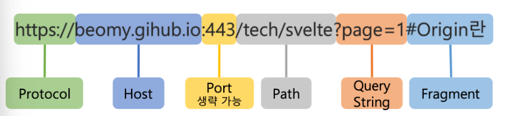

- 위 사진에서 `Protocol + Host + Port` 가 **같으면 동일 출처**(Origin)이라고 함.
- **동일 출처** 예시
    - `http://example.com:80`, `http://example.com`
    - `http://example.com/app1/index.html`, `http://example.com/app2/index.html`
- **다른 출처** 예시
    - `http://example.com/app1`, `https://example.com/app2` → **프로토콜이 다름**
    - `http://example.com`, `http://www.example.com`, `http://myapp.example.com` → **Host가 다름.**
    - `http://example.com`, `http://example.com:8080` → 80, 8080으로 **포트가 다름.**

### 2. CORS 에러가 발생하는 원인을 SOP와 관련하여 설명해주세요.

❓ **SOP(Same-Origin Policy)** : 브라우저의 보안 정책 중 하나로 오직 **동일한 출처끼리만 데이터를 주고 받을 수** 있도록 하는 정책

- 이러한 정책 때문에 `Protocol + Host + Port`가 다르면 CORS에러가 발생함.

### 3. 쿠키와 세션의 차이점에 대해 설명해주세요.

|  | 쿠키 | 세션 |
| --- | --- | --- |
| 저장 위치 | 로컬 | 로컬, 서버 |
| 보안 | 탈취와 변조 가능 | ID 값만 가지고 있고 서버에도 저장되어 있기 때문에 상대적으로 안전 |
| Lifecycle | 브라우저 종료 후에도 파일로 남아 있음. | 브라우저 종료시 삭제 |
| 속도 | 파일에서 읽기 때문에 상대적으로 빠름 | 요청마다 서버에서 처리를 해야 하기 때문에 상대적으로 느림. |

### 4. 프록시와 프록시 서버에 대해 설명해주세요.

✔️ **프록시(Proxy)** : 주로 보안상의 문제를 방지하기 위해, 직접 통신하지 않고 중계자(Proxy)를 거친다는 개념.

- 즉, 클라이언트가 프록시를 통해서 다른 네트워크 서비스에 간접적으로 접속할 수 있게 해주는 컴퓨터 시스템이나 응용 프로그램

**✔️ Proxy 서버** 

- 클라이언트에서 서버로 접속 할 때 직접적으로 접속하지 않고 **중간에 대신 전달해주는 서버**
1. 클라이언트에서 프록시 서버로 전달할 요청을 보냄.
2. 프록시 서버는 클라이언트로부터 전달 받은 요청을 서버에 요청.
3. 서버는 요청에 맞게 데이터를 프록시 서버로 전달
4. 프록시 서버는 서버로부터 전달 받은 데이터를 클라이언트에 전달
- `**Forward Proxy**` : **클라이언트에서 요청**할 때 프록시 서버를 거치는 방식
- `**Reverse Proxy**` : **서버에서 데이터를 전달**할 때 프록시 서버를 거치는 방식

### 5. JWT 에 대해서 설명해주세요.

✔️ JWT(JSON Web Token)

- 인증에 필요한 정보들을 암호화시킨 JSON 토큰을 의미
- JWT 토큰(Access Token)을 HTTP 헤더에 실어 서버가 클라이언트를 식별하는 방식
- JSON 데이터를 Base64 URL-safe Encode를 통해 인코딩하여 직렬화한 것
    - `Base64 URL -safe Encode` : Base64 Encode의 URL에서 오류없이 사용하도록 **`‘+’`, `‘/’`를** **각각** `‘-’`, `‘_’`로 **표현한 것**.
- 토큰 내부에는 위변조 방지를 위해 개인키를 통한 전자 서명도 들어있음.
- 세 가지 문자열의 조합 : `Header + Payload + Signature`
    
    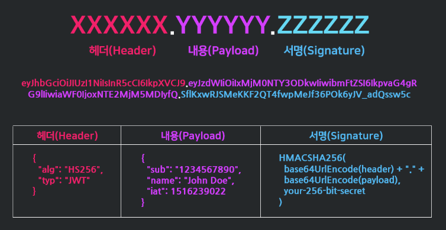
    
- `**Header**` : **JWT에서 사용할 타입**과 **해시 알고리즘의 종류**가 담겨 있음.
- `**Payload**` : 서버에서 첨부한 **사용자 권한 정보**와 **데이터**
- `**Signature**` : Header, Payload를 Base64 URL -safe Encode 한 이후 Header에 명시된 해시함수를 적용하고 개인키로 서명한 **전자서명**이 담겨있음.

### 6. 세션 기반 인증과 토큰 기반 인증의 차이에 대해 얘기해주세요.

- **세션 기반 인증** - **서버에 저장**, 상태 유지를 함.(**Stateful**)
- **토큰 기반 인증** - **클라이언트에 저장**, 상태 유지하지 않음.(**Stateless**)

### 7. 그렇다면 Stateful한 세션 기반의 인증 방식을 사용하게 된다면 어떠한 단점이 있을까요?

- 클라이언트로부터 요청을 받으면 클라이언트의 상태를 계속 유지해야 하기 때문에 **사용자가 증가하면 성능의 문제**를 일으킬 수 있고 **확장성이 어려움**.

### 8. 그렇다면 세션 기반 인증과 토큰 기반 인증은 각각 어느 경우에 적합한가요?

토큰 기반 인증 : 앱에는 쿠키와 세션이 없기 때문에 **앱과 서버가 통신 및 인증**할 때 많이 사용됨.
