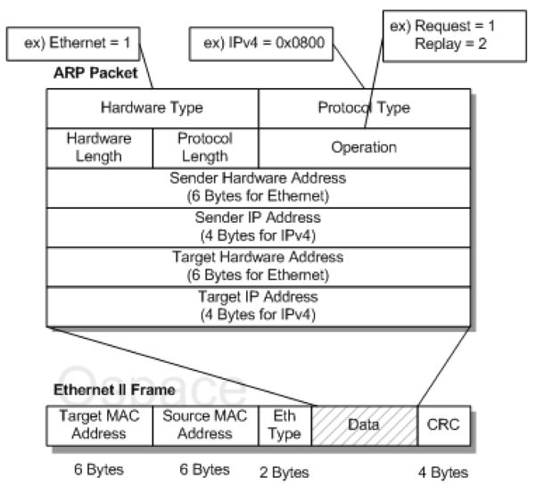
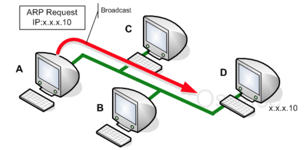
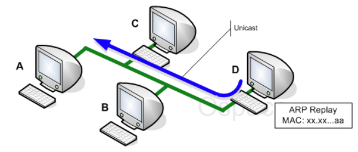

# CS Study - Network

<!-- prettier-ignore -->
|<- 이전 | 현재 | 다음 ->|
|:---:|:---:|:---:|
|[IP 주소](./network-ip.md)|ARP 프로토콜|[IPv4, ICMP 프로토콜](./network-ipv4-icmp.md)|

 

# 4. ARP 프로토콜

## ❓ ARP 프로토콜에 대해 설명해주세요.

 

### ARP (Address Resolution Protocol) 프로토콜

논리 주소인 IP 주소를 실제적인 물리 주소, 즉 MAC 주소로 바꾸어주는 역할을 하는 주소 결정 프로토콜  
 

### ARP 패킷 구조

 

 

<!-- prettier-ignore -->
|패킷 타입|설명|
|---|---|
|Hardware Type|16bit로 ARP가 수행되고 있는 네트워크 유형을 정의 이더넷인 경우 값은 1로 설정됨|
|Protocol Type|16bit로 상위 프로토콜을 정의 상위 프로토콜이 IP일경우 0x0800으로 설정됨|
|Hardware Length|8bit로 물리주소의 길이를 바이트 단위로 정의 이더넷인 경우 6으로 설정|
|Protocol Length|8bit로 논리주소의 길이를 바이트단위로 정의 이더넷인 경우 4로 설정|
|Operation|6bit로 패킷의 유형을 정의 ARP Request : 1, ARP Reply : 2|
|Sender Hardware Address|송신자의 물리주소를 나타내는 필드 이더넷의 경우 이필드는 6byte값|
|Sender IP Address|송신자의 논리주소를 나타내는 필드 IP프로토콜인 경우 4byte값|
|Target Hardware Address|목적지 시스템의 물리주소를 정의 이더넷의 경우 6byte값 ARP Request인 경우 목적지의 MAC을 몰라 0으로 설정|
|Target IP Address|목적지 시스템의 논리주소를 정의 IP 프로토콜의 경우 4byte값|

 

### ARP의 동작 원리

- 송신자는 목적지 물리주소가 필요하므로, 물리주소 요청을 위한 ARP요청 패킷을 브로드캐스트로 전송  
  (브로드캐스트를 하는 이유는 목적지의 물리주소를 모르므로 모두에게 요청)  
  (요청 패킷에는 수신자가 수신자 주소를 응답할 때 필요한 송신자 주소가 포함)
- 모든 호스트와 라우터는 송신자가 보낸 ARP 요청 패킷을 수신
- 해당 수신자만 자신의 논리주소와 물리주소를 넣어 응답 패킷을 유니캐스트로 전송  
   

> ### ND (Neighbor Discovery), NDP (Neighbor Discovery Protocol)
>
> - IPv6는 IPv4와 구조가 다른만큼 MAC와 IP를 서로 가져오는 기능이 다른 방식으로 동작
> - IPv4 ARP는 Link Layer에서 이루어지는 Link Layer Protocol
> - IPv6 ARP는 Internet Layer에서 이루어지는 Internet Layer Protocol

 

### ARP의 동작 과정

 

 

1. 송신자는 목적지 IP Address를 지정해 패킷 송신
2. IP 프로토콜이 ARP 프로토콜에게 ARP Request 메시지를 생성하도록 요청  
   = ARP 요청 메시지 (송신자 물리주소, 송신자 IP주소, 00-00-00-00-00, 수신자 IP주소)
3. 메시지는 2계층으로 전달되고 이더넷 프레임으로 Encapsulation 됨  
   = 송신자 물리주소를 발신지 주소, 수신자 물리주소를 브로드캐스트 주소로 지정
4. 모든 호스트와 라우터는 프레임을 수신 후 자신의 ARP 프로토콜에게 전달

 

 

5. 목적지 IP Address가 일치하는 시스템은 자신의 물리주소를 포함하고 있는 ARP Reply 메시지를 보냄  
   = 자신의 물리주소를 포함하는 응답 메시지
6. 최초 송신 측은 지정한 IP Address에 대응하는 물리주소를 획득  
   cf) ARP 요청은 브로드캐스트, ARP 응답은 유니캐스트

 

## ❓ ARP와 RARP를 비교해서 설명해주세요.

### RARP (Reverse Address Resolution Protocol) 프로토콜

물리 주소인 Mac 주소를 시스템의 논리 주소, 즉 IP 주소로 바꾸어주는 역할을 하는 동적 매핑 프로토콜  
 

### ARP와 RARP를 비교

<!-- prettier-ignore -->
|ARP|RARP|
|---|---|
|주소 확인 프로토콜|역방향 주소 확인 프로토콜|
|리시버의 물리 주소를 획득|서버의 논리 주소를 획득|
|논리 주소(IP)를 48비트의 물리 주소(Mac)로 변경|48비트의 물리 주소(Mac)를 논리 주소(IP)로 변경|

 
