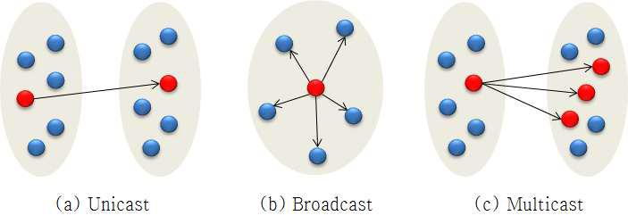

# CS Study - Network

빠른 이동
|<- 이전 | 현재 | 다음 ->|
|:---:|:---:|:---:|
|[목차](./README.md)|네트워크와 모델|[데이터 통신](./network-data_communication.md)|

 

# 1. 네트워크와 모델

## ❓ 네트워크, 인터넷, 프로토콜에 대해서 설명해주세요.

 

### 네트워크(Computer Network)

노드(컴퓨터)들이 자원을 공유할 수 있게 하는 디지털 전기통신망 중 하나이다.  
네트워크의 복잡도로 인해 네트워크의 작업 방법을 설명하기 위한 여러 개념적 모델이 등장, 가장 일반적인 모델 중 하나가 ISO의 개방 시스템 연결 규약(OSI) 참조 모델이다. 이는 OSI 7계층 모델 이라고도 한다.  
 

[대표적인 네트워크 모델인 OSI 7 Layers]

 

### 인터넷(Internet)

컴퓨터로 연결하여 TCP/IP라는 통신 프로토콜을 이용해 정보를 주고받는 컴퓨터 네트워크이다.  
대표적인 형태로는 월드 와이드 웹(World Wide Web, www)이 있으며, 이 외에도 전자 메일, 파일 공유, 스트리밍, VoIP 등의 서비스 또한 인터넷이다.  
 

### 프로토콜(Protocol)

서로 다른 시스템 및 기기 간 데이터 교환을 원활히 하기 위한 표준화 된 통신 규약이다.  
기기 간의 통신을 데이터 형식에 대한 상호 협의를 통해 구현된 것으로 동일한 프로토콜을 사용하면 하드웨어나 소프트웨어의 목적 및 형태가 달라도 기기간의 상호 통신이 가능하다.  
 

**프로토콜의 기본 요소**

- 구문(Syntax)  
  송수신 데이터의 형식, 코딩, 신호 레벨 등을 규정
- 의미(Semantic)  
  제어 정보로 조정과 에러 처리를 위한 규정
- 타이밍(Timing)  
  (시스템 간 정보 전송을 위한) 속도 조절과 순서 관리 규정  
   

**프로토콜의 특징**

- 단편화, 재조립, 캡슐화, 연결 제어, 오류 제어, 동기화, 다중화, 주소 지정  
   

**통신 프로토콜**

- TCP, UDP, IP  
   

 

## ❓ 네트워크 통신방식 3가지를 설명하고 해당 통신방식에 속하는 예시를 하나 설명해주세요.

 

 

### Unicast

1 : 1 통신 방식으로, 정확한 목적지를 가지고 통신한다.  
1 : 1 방식이기 때문에 같은 네트워크에 연결된 다른 PC에게 부하를 주지 않는다.  
그러나 많은 host들과 통신할 때는 비효율적이다.  
  

### Multicast

1 : 多 통신 방식으로, 그룹을 지정하고 그 그룹에게 통신한다.  
일반적으로 UDP를 사용하며, 그 이유는 특정 채널에 일괄된 데이터를 뿌리기만 하기에 TCP의 재전송 등 흐름 제어 기능이 굳이 필요치 않다. 따라서 시스템 복잡성을 줄이기 위해 UDP를 사용한다.  
같은 네트워크에서 특정 단말에만 보낼 수 있어 특정 그룹이나 특정 단체와 통신할 때 효율적이다.  
  

### Broadcast

1 : 多 통신 방식으로, 별도의 목적지를 가지지 않고 통신한다.  
같은 네트워크 망 안에 있다면 해당하는 모든 기기에 데이터를 뿌린다.  
같은 네트워크상에 있는 모든 장비에게 패킷을 전달하기 때문 네트워크 부하가 세다.  
  

 

## ❓ 네트워크 모델 2가지를 설명하고 두 모델의 공통점과 차이점을 설명해주세요.

 

### TCP/IP

OSI 모델과 달리 4 개의 레이어로 구성되어 있으며 각 레이어에는 프로토콜이 있다.  
TCP / IP 제품군은 TCP, UDP, ARP, DNS, HTTP, ICMP 등을 포함하는 프로토콜 집합이기도 하다.

TCP/IP의 계층 구조

- 네트워크 인터페이스 계층
- 인터넷 계층
- 전송 계층
- 응용 프로그램 계층  
   

### OSI 7 Layers

OSI (개방형 시스템 상호 연결) ​​모델이며, 엄밀하게 프로토콜이 아니라 네트워크 레이어 모델일 뿐이다.  
데이터를 전송하는 상향식 접근 방식을 취한다.

OSI의 계층 구조

- 응용 프로그램 계층
- 프리젠 테이션 레이어
- 세션 계층
- 전송 계층
- 네트워크 계층
- 데이터 링크 계층
- 물리 계층  
   

### TCP/IP와 OSI의 주요 차이점

 

<!-- prettier-ignore -->
| TCP/IP | OSI 7 Layers |
|:---:|:---:|
| 클라이언트 - 서버 모델 | 개념 모델 |
|인터넷을 포함한 모든 네트워크에 사용되는 표준 프로토콜 | 프로토콜이 아니라 시스템 아키텍처를 이해하고 설계하는 데 사용되는 참조 모델 |
| 4개의 계층 모델 | 7개의 계층 모델 |
| 수직 접근 방식 | 수평적 접근 |
| 위에서 아래로의 접근 | 상향식 접근 |

 
