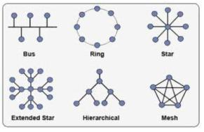
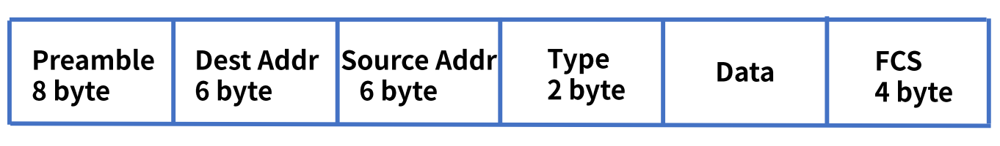

# CS Study - Network

빠른 이동
|<- 이전 | 현재 | 다음 ->|
|:---:|:---:|:---:|
|[네트워크와 모델](./network-basic.md)|데이터 통신|[IP 주소](./network-ip.md)|

 

# 2. 데이터 통신(Data Communication)

## ❓ Ethernet에 대해 설명하세요.

 

가정이나 건물과 같은 로컬 환경의 컴퓨터 및 기타 장치를 네트워크에 연결하기 위해 개발된 통신 표준
로컬 환경은 LAN(Local Area Network)으로 정의되며 여러 장치를 연결하여 해당 위치의 다른 사람들과 정보를 작성, 저장 및 공유할 수 있다.  
 

현재 이더넷은 UTP 케이블 및 광케이블을 사용하며, 단거리 또는 옥내에서는 UTP 케이블을 사용하고 먼 거리를 이더넷으로 연결해야 하거나 전자파 간섭이 심한 환경에서는 광케이블을 통해 전송한다. 이와 함께 네트워크 구조도 버스형에서 스타형으로 변경되어 모든 케이블이 모이는 네트워크 허브 및 스위칭 허브를 사용하게 되었습니다.  
 

이더넷 표준은 1983년 IEEE 802.3이 유선 이더넷의 "데이터 링크"계층의 물리 계층과 MAC(미디어 액세스 제어) 부분을 정의했으며, 물리 계층은 케이블과 장치로 구성된다.  
 

 

## ❓ LAN에 대해 설명하세요.

 

근거리 통신망또는 로컬 영역 네트워크(local area network, LAN)  
한 건물이나 일정 지역 내에서 단말기들을 회선으로 연결하여 프로그램, 파일 또는 주변장치를 하는 네트워크 형태  
 

### LAN의 특징

- 단일 기관의 소유, 제한된 지역 내의 통신
- 광대역 전송 매체의 사용으로 고속 통신이 가능
- 공유 매체를 사용하므로 경로 선택 없이 매체에 연결된 모든 장치로 데이터를 전송
- 오류 발생률이 낮음
- 네트워크에 포함된 자원을 공유
- 네트워크의 확장이나 재배치가 비교적 쉬움
- 전송매체로 꼬임선, 동축 케이블, 광섬유 케이블들을 사용
- 망의 구성 형태에 따라서 성형, 버스형, 링형, 계층형으로 분류 함  
   

### LAN의 구축 형태

 

  
 

1. **Bus Topology (버스형)**  
   신뢰성과 확장성이 좋으며 모든 노드 들이 버스에 T 자형으로 연결 되어 상호 Point - to - Poing 형태를 가진다. 각 노드들의 연결은 어뎁터(Adapter)를 사용하며 양 끝 단에 Terminator를 둔다. 각 노드의 고장은 전체 네트워크 부분에 영향을 미치지 는 다른 장점을 가지며 CSMA/CD 방식을 주로 사용, 케이블 사용량이 적기 때문에 투자 비용이 적게 드는 편.

2. **Ring Topology (링형)**  
   통신제어가 간단하고 신뢰성이 높으며 장거리 네트워크에서 사용 가능하다. 링(Ring) 형태를 이루지만 노드간 통신은 Point-to-Point 를 가지며 각 노드에서 신호 재생이 가능 하기 때문에 버스 형태와 달리 거리 제약이 적으며 잡음에도 강하다.

3. **Star Topology (스타형/성형)**  
   중앙 제어 방식으로 모든 기기가 Point-to-Point 방식으로 연결 되어 있으며 문제 해결이 쉽고 하나의 기기의 고장은 전체에 영향을 미치지 않지만 중앙 제어 장비가 고장이 나면 모든 시스템에 영향을 미치게 된다. 케이블 사용량이 많으며 비용 또한 큰 편.

4. **Mash Topology (메쉬형)**  
   네트워크 상의 모든 컴퓨터들이 연결되어진 형태로써 연결 된 기기나 노드가 고장나더라도 다른 경로를 통해 통신이 가능하며 어떠한 경우에도 네트워크가 동작한다. but, 네트워크에 연결된 기기의 수가 많을 경우 모든 기기와 연결 해야 하기 때문에 케이블 사용량이 많고 구조가 복잡하여 네트워크 관리가 힘들어 진다는 단점을 가지고 있다.  
    

 

## ❓ 데이터 링크 계층의 역할에 대해 설명하세요.

 

데이터 링크 계층(Data Link Layer)은 OSI 7 Layer의 2계층  
장치 간 신호를 전달하는 물리 계층을 이용하여 네트워크 상의 주변 장치들 간 데이터를 전송  
대표적인 프로토콜은 이더넷 이며,대표적인 하드웨어 장비는 네트워크 스위치(Switch)  
 

### 이더넷 프레임의 구조

 

  
 

- 프레엠블(Preamble)  
  실제 이더넷에 포함되지는 않으나, 이더넷 프레임의 시작과 동기화를 담당
- 목적지 주소  
  목적지 MAC 주소
- 출발지 주소  
  출발지 MAC 주소
- 타입  
  캡슐화된 패킷의 프로토콜을 정의
- 데이터  
  상위 계층의 데이터입니다. 46~1500바이트 크기이며, 46바이트보다 작은 경우 뒤에 패딩이 붙음
- FCS  
  트레일러 부분으로 에러를 체크  
   

### 데이터 링크 계층 구성

1. MAC 계층  
   물리적인 부분이며, 매체 간의 연결 방식을 제어한다. 물리계층과 연결되있다.
2. LLC 계층  
   논리적인 부분이며, 프레임을 만든다. 네트워크 계층과 연결되있다.  
    

### 데이터 링크 계층의 주요 기능

1. 프레임 생성 기능  
   데이터를 캡슐화시켜 프레임 단위로 만들고, 앞에 헤더, 뒤에는 트레일러를 추가한다. 헤더에는 목적지, 출발지 주소 및 데이터 내용을 정의한다. 트레일러는 비트 에러를 감지하는 부분이다.

2. 회선 제어 기능  
   컴퓨터 2대가 통신하는 경우, 각 컴퓨터 신호간의 충돌이 발생하지 않도록 데이터 링크 계층에서 회선을 제어한다.

   - ENQ/ACK 기법
   - Polling 기법  
      

3. 흐름 제어 기능  
   컴퓨터마다 성능과 네트워크 환경이 다르기 때문에 데이터를 주고 받을 때 속도 차이가 있을 수 있습니다. 데이터 링크에서는 이러한 속도 차이를 해결하기 위해서 흐름을 제어한다.

   - Stop & Wait
   - Sliding Window  
      

4. 오류 제어 기능  
   데이터 링크 계층은 전송 중에 오류나 손실이 발생하면, 이를 탐지하여 수정할 수 있다. 프레임이 손상되어 재전송이 수행되는 과정을 Automatic Repeat Request(ARQ)라고 한다.

   - Stop & Wait ARQ
   - Go Back n ARQ
   - Selective Repeat ARQ  
      

 
