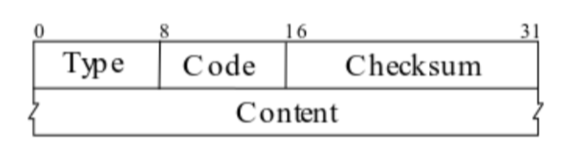
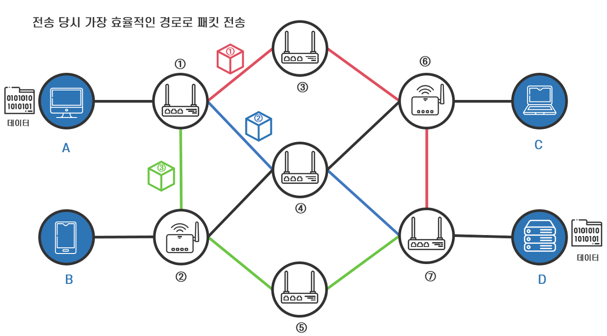

# CS Study - Network

<!-- prettier-ignore -->
|<- 이전 | 현재 | 다음 ->|
|:---:|:---:|:---:|
|[ARP 프로토콜](./network-arp_protocol.md)|IPv4, ICMP 프로토콜|[전송계층 및 포트](./network-port.md)|

 

# 5. IPv4, ICMP 프로토콜

## ❓ IPv4가 하는일과 IPv4 프로토콜 구조를 설명해주세요.

### IPv4(Internet Protocol Version 4)

IPv4는 인터넷 프로토콜의 4번째  
패킷 교환 네트워크 상에서 데이터를 교환하기 위한 프로토콜  
데이터가 정확하게 전달될 것을 보장하지 않고, 중복된 패킷을 전달하거나 패킷의 순서를 잘못 전달할 가능성이 있음  
데이터의 정확하고 순차적인 전달은 그보다 상위 프로토콜인 TCP에서(그리고 UDP 일부) 보장

 

### IPv4 프로토콜 패킷 구조

 

 

<!-- prettier-ignore -->
|헤더 포멧|오프셋|비트|설명|
|---|:---:|:---:|---|
|버전|0~3|0|인터넷 프로토콜의 버전|
|IHL(Header Length)|4~7|0|IP헤더의 길이를 4byte 단위로 표현|
|TOS(Type of Service)|8~15|0|IP패킷의 우선순위를 정의(음성 -> 영상 -> 텍스트)|
|총 길이|16~31|0|패킷(헤더 + 데이터)의 길이를 바이트 단위로 표시|
|식별자|0~15|32|패킷을 식별하는 번호|
|플래그|16~18|32|패킷이 단편화 됐는지 아닌지 정보를 제공 1번째 비트: 예약 비트(항상0) 2번째 비트: 분할 여부(Y:1/N:0) 3번째 비트: 후속 패킷 여부(Y:1/N:0)|
|프래그먼트 오프셋|19~31|32|패킷 재조립 시 패킷 간의 순서 정보 패킷 간의 상대 정보를 8byte 단위로 표시|
|TTL(생존시간)|0~7|64|패킷이 경유할 수 있는 최대 홉 수 라우터를 통과할때 마다 1씩 감소, 0이되면 폐기 패킷 무한 루프 방지|
|프로토콜|8~15|64|상위 계층 프로토콜을 기록 ICMP:0x01 TCP:0x06 UDP:0x11|
|체크섬|16~31|64|IP 패킷 헤더 오류 발생여부 확인|
|출발 주소|0~31|96|출발지 IP 주소|
|도착 주소|0~31|128|목적지 IP 주소|
|옵션(IHL > 5인 경우)|0~31|160 ~ 256|특별한 처리 옵션이 추가되는 영역 IHL는 4byte단위로 헤더를 구분하므로 옵션필드에는 4byte 단위 패딩 추가|
|데이터|0~31|< 65515 bytes|패킷에 담긴 데이터 본체|

## ❓ ICMP가 하는일과 ICMP 프로토콜 구조를 설명해주세요.

### ICMP(Internet Control Message Protocol)

인터넷 프로토콜의 지원 프로토콜  
라우터를 포함한 네트워크 장치에서 다른IP주소와 통신할 때 성공 또는 실패를 나타내는 오류 메시지나 작동 정보를 보내는 데 사용

1. Error 알림  
   패킷 전송이 실패했을 때 에러가 났음을 알림과 동시에, 해결 가능한 힌트를 제공합니다.

2. 진단/ 정보전달 메세지 ( 예 : ping 123.0.0.1 )  
   ping, tr aceroute 명령 등등 진단과 정보전달을 하는데에 사용합니다.

 

### ICMP 프로토콜 패킷 구조

 

 

<!-- prettier-ignore -->
|헤더 포멧|오프셋|비트|설명|
|---|:---:|:---:|---|
|타입|0~7|0|ICMP 패킷의 종류|
|코드|8~15|0|타입을 더 자세히 분류|
|체크섬|16~31|0|ICMP 패킷 헤더 오류 발생여부 확인|
|추가 필드|0~31|32|Type에 따라 필요하면 사용함. 쓰지 않으면 0으로 채움|

 

### 주요 ICMP 프로토콜 제어 메세지

<!-- prettier-ignore -->
|타입|설명|
|---|---|
|0|에코 응답|
|3|도달할 수 없는 목적지|
|5|리디렉션 메시지|
|8|에코 요청|
|11|시간 초과|
|30|경로 추적|
|42|확장 에코 요청|
|43|확장 에코 응답|

 

## ❓ 다른 네트워크까지 내 패킷의 이동 과정을 설명해주세요.

### 노드와 링크

 

 

#### 노드

네트워크에 연결되어 있는 단말. 가장자리에 연결된 노드인 최초 송/수신 노드를 호스트라 하고, 호스트와 호스트 사이에 위치한 노드를 중간 노드라 함

 

#### 링크

네트워크를 구성하는 각 노드(단말) 간의 연결  
송신 호스트가 전송한 데이터가 중간 노드에 도착하면 노드와 연결된 링크 중에 어떤 링크로 이동할지를 선택해 다음 노드로 이동함. 수신 호스트에 도착할 때까지 데이터는 각 노드에 연결된 적절한 링크를 선택하는 과정을 반복하며 이동 경로를 찾음

 

### 데이터 교환 방식

#### 회선 교환(Sircuit Switching)

 

 

두 호스트가 데이터를 전송하기 전에 미리 하나의 고정된 이동 경로를 설정하는 방식  
미리 설정된 이동 경로는 두 호스트만이 독점적으로 사용하는 전용 경로  
통신을 종료할 때까지 변경되지 않기 때문에 모든 데이터가 같은 경로로 전달  
 

데이터를 전송하는 시점의 네트워크 혼잡도 등 여러 요인에 따라 데이터 전송 속도와 품질이 달라지는 데, 회선 교환 방식은 데이터 전송 전에 미리 이동 경로를 결정하기 때문에 데이터 전송이 효율적이지 못한 경우가 발생  
 

#### 패킷 교환(Packet Switching)

 

 

미리 고정된 이동 경로를 설정하지 않는 대신 데이터를 패킷(Packet)이라고 하는 작은 단위로 나누어 전송하는 방식  
패킷은 네트워크에서 데이터를 전송하기 쉽도록 분할한 전송의 기본 단위  
데이터는 패킷으로 나뉘고 각 패킷에는 고유 번호가 있어서 네트워크를 거쳐 최종 수신지에 전송되었을 때 원래의 데이터로 재결합  
각 패킷은 전송 당시 가장 효율적인 경로를 각자 설정해 최종 수신지까지 이동  
각 패킷들은 서로 독립적인 라우팅 과정을 거쳐 수신 호스트에 도착하기 때문에 패킷마다 전송에 걸리는 시간이 다르고, 출발한 순서와 무관하게 수신 호스트에 도착  
 

> #### 라우팅(Routing)
>
> 패킷을 수신한 중간 노드가 패킷의 수신지를 확인하고 수신지까지 가는 경로 중 그 당시 가장 좋다고 판단되는 경로를 따라 다음 중간 노드로 패킷을 전송하는 기능

 

> #### 데이터 캡슐화(Data Encapsulation)
>
> 네트워크에서 사용중인 프로토콜을 통해 데이터를 작은 단위로 분할하고, 분할된 데이터 앞에 패킷의 번호, 패킷의 송신지 및 수신지 등 패킷의 전송을 제어하기 위한 정보를 담은 패킷 헤더를 붙여 패킷이라는 형태로 변환하여 네트워크로 전송하는 것

 

### 계층별 데이터 전송 과정

 

 
