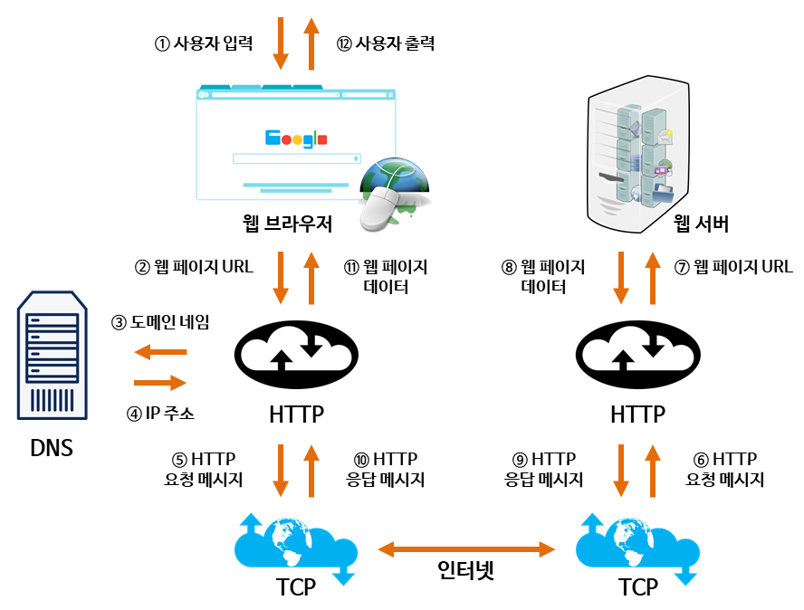

# CS Study - Network

<!-- prettier-ignore -->
|<- 이전 | 현재 | 다음 ->|
|:---:|:---:|:---:|
|[IPv4, ICMP 프로토콜](./network-ipv4-icmp.md)|전송계층 및 포트|[TCP와 UDP 비연결지향형](./network-tcp-udp.md)|

 

# 6. 전송계층 및 포트

## ❓ 포트(Port)에 대해 설명하세요.

### 포트(Port)

네트워크 상 고유하게 식별하고 데이터를 특정 서비스로 보내기 위해 할당된 엔드 포인트  
OS 내의 sw 수준에서 특정 프로세스 또는 네트워크 서비스 유형을 식별하는 논리적 구조  
일반적인 전송 프로토콜은 TCP와 UDP가 있다.
 

### 포트 번호(Port Number)

TCP 및 UDP의 경우 포트 번호는 16비트 부호 없는 정수이므로 범위는 0~65535  
TCP는 포트 번호 0이 예약되어 사용할 수 없고, UDP는 소스 포트는 선택 사항이며 값은 0 포트가 없음을 의미  
**바인딩(Binding)** 은 프로세스가 전송 프로토콜, IP 주소 와 같은 네트워크 주소 및 포트 번호와 소켓을 통해 입력 또는 출력 채널을 연결하는 것을 말함

 

## ❓ 주요 Well-Known Port에 대해 아는대로 설명해주세요.

Well-Known Port는 시스템 포트라고도 불리며, 이미 특정 목적을 위해 시스템에서 사용하기 위해 미리 할당된 포트이다.  
 

<!-- prettier-ignore -->
|포트 번호|설명|
|:---:|---|
|20|파일 전송 프로토콜(FTP) 데이터 전송|
|21|파일 전송 프로토콜(FTP) 명령 제어|
|22|보안 셸(SSH) 보안 로그인|
|23|Telnet 원격 로그인 서비스, 암호화되지 않은 문자 메시지|
|25|SMTP(Simple Mail Transfer Protocol) 이메일 전송|
|53|도메인 이름 시스템(DNS) 서비스|
|67, 68|동적 호스트 구성 프로토콜(DHCP)|
|80|World Wide Web 에서 사용되는 HTTP(Hypertext Transfer Protocol)|
|110|우체국 프로토콜(POP3)|
|119|NNTP(네트워크 뉴스 전송 프로토콜)|
|123|NTP(네트워크 시간 프로토콜)|
|143|IMAP(Internet Message Access Protocol) 디지털 메일 관리|
|161|단순 네트워크 관리 프로토콜 (SNMP)|
|194|IRC(인터넷 릴레이 채팅)|
|443|HTTP 보안(HTTPS) TLS/SSL을 통한 HTTP|
|546, 547|DHCPv6 DHCP의 IPv6 버전|

 

## ❓ 클라이언트와 서버의 통신 과정에 대해 설명해주세요.

### 클라이언트(Client)

서버와 이어진 모든 PC와 단말기에서 이용하는 웹에 접근하는 SW이며, 주로 서버에 요청을 보내고 응답을 받는 역할  
 

### 서버(Server)

다수의 클라이언트에게 서비스를 제공하기 때문에 고사양의 하드웨어를 갖춘 PC  
서비스를 제공하는 소프트웨어를 실행하고 클라이언트의 요청을 받고 응답을 하는 역할  
 

### DNS(Domain Name Server)

실제 웹주소는 IPv4나 IPv6로 구성되어 있어 63.245.217.105와 같은 숫자로 이루어 짐  
이러한 IP주소를 사용자가 이해하기 쉽게 특정문자의 나열로 이루어진 주소인 도메인(Domain)으로 매핑해주는 서버  
만약 google.com을 클라이언트에서 입력한다면 DNS에서 8.8.8.8또는 그 외의 구글 서비스가 할당된 ip로 이동하게 됨  
 

### 서버와 클라이언트의 연결

 

서버와 클라이언트가 통신하기 위해선 통신 프로토콜을 사용해서 연결  
TCP/IP, HTTP 등의 프로토콜을 통해서 연결(다른 스터디 문서 참고)

 
