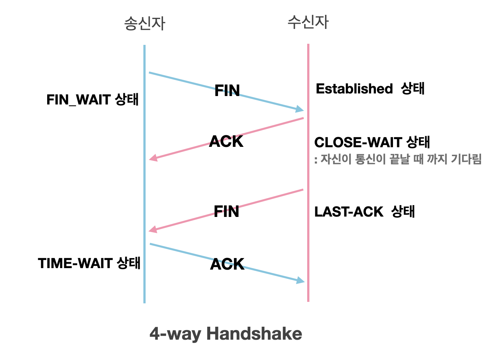

# CS Study - Network

<!-- prettier-ignore -->
|<- 이전 | 현재 | 다음 ->|
|:---:|:---:|:---:|
|[전송계층 및 포트](./network-port.md)|TCP와 UDP|[NAT와 포트포워딩](./network-nat-port_forwarding.md)|

 

# 7. TCP와 UDP

## ❓ TCP의 특징에 대해서 설명하세요.

### 연결 지향적 프로토콜(Trasmission Control Protocol, TCP)

클라이언트와 서버가 연결된 상태에서 데이터를 주고받는 프로토콜  
클라이언트가 연결 요청(SYN 데이터 전송)을 하고, 서버가 연결을 수락하면 통신 선로가 고정되고, 모든 데이터는 고정된 통신 선로를 통해서 순차적으로 전달  
 

### TCP의 장점

- 데이터를 정확하고 안정적으로 전달
- 호스트간 신뢰성 있는 데이터 전달과 흐름 제어  
   

### TCP의 단점

- 데이터로 보내기 전에 반드시 연결이 형성되야 함
- 1 : 1 통신만 가능
- 고정된 통신 선로가 최단이 아닐 경우 상대적으로 UDP보다 데이터 전송속도가 느림  
   

## ❓ UDP의 특징에 대해서 설명하세요.

### 비연결 지향적 프로토콜(User Datagram Protocol, UDP)

별도의 연결 절차를 거치지 않고 발신자가 일방적으로 데이터를 발신하는 프로토콜  
연결 과정이 없어 TCP보다는 빠른 전송을 할 수 있지만 데이터 전달의 신뢰성은 떨어짐  
패킷이 유실되거나 변조 되어도 UDP는 재전송 하지 않음  
 

### UDP의 장점

- 별도의 연결을 필요로 하지 않아 TCP보다 빠름
- UDP를 발신하는 서버 측은 연결을 유지하지 않아도 되므로 부담이 적음
   

### UDP의 단점

- 수신지에 패킷이 잘 도착했는지 확인하지 않음
- 패킷이 유실되거나 변조되어도 재전송하지 않아 신뢰성이 TCP보다 낮음  
   

### TCP와 UDP 비교

 

<!-- prettier-ignore -->
|TCP|UDP|
|---|---|
|연결형 서비스로 연결이 성공해야 통신이 가능|비연결형 서비스로 연결 없이 통신이 가능하며 데이터그램 방식을 제공|
|데이터의 경계 구분 하지 않음(바이트 스트림 서비스)|데이터 경계 구분(데이터그램 서비스)|
|데이터의 전송 순서를 보장|데이터의 전송 순서를 보장하지 않음|
|신뢰성있는 데이터를 전송(Seq, Ack를 통한 신뢰성 보장)|신뢰성 없는 데이터를 전송(순서 유지 작업 X)|
|데이터 흐름 제어(수신 버퍼 오버플로우 방지) 혼잡 제어(패킷 수가 폭증 현상 방지)|데이터 흐름 제어나 혼잡 제어가 없음|
|연결의 설정(3-way handshaking) 해제(4-way handshaking)|연결의 설정이 없음|
|전이중(Full-Duplex) 점대점(Point to Point)|단방향(Simplex) 다중점(Multi-Point)
|전송 속도가 상대적으로 느림|전송 속도가 상대적으로 빠름|

 

## ❓ 3-way handshake에 대해 설명해주세요.

### 3-way handshake

데이터 전송 전에 송신자와 수신자 사이에 세션을 수립하는 과정

 

### 3-way handshake 과정

아래 3 단계를 거치면서 클라이언트와 서버 모두 데이터를 전송하고 받을 준비가 되었다는 것을 보장하여 안전한 데이터 전송이 이루어 지게 됨

1. **클라이언트**  
   서버에 연결을 요청하는 SYN 패킷을 보낸 후 응답 대기  
   SYN_SENT 상태를 유지  
   **서버**  
   클라이언트의 요청을 받기 전엔 Wait for Cleint 상태를 유지

2. **서버**  
   클라이언트가 보낸 SYN 패킷을 받고 SYN_RECEIVED 상태가 됨  
   SYN+ACK(요청을 수락한다는 ACK 와 SYN flag가 설정된 패킷)를 보내 응답

3. **클라이언트**  
   서버의 응답을 받고 다시 서버에 ACK 패킷으로 응답  
   **서버**  
   클라이언트의 ACK를 받은 후 부터 세션이 생성(Established)

### 클라이언트가 서버의 ACK+SYC을 받지 못한다면?

클라이언트와 서버 둘 다 응답대기상태가 됨  
서버는 이 연결을 백로드 큐(메모리 공간)에 저장  
일정 시간 응답이 안 오면 연결 해제  
이런 취약점을 이용해 SYN Flooding이라는 공격이 가능함
 

> #### SYN Flooding
>
> 존재하지 않는 클라이언트 IP로 응답이 없는 연결을 초기화 하기 전에 1단계 요청만 무수히 많이 보내 백로그 큐를 포화 상태로 만들어 다른 사용자가 연결 요청을 못하게 하는 공격 방법

 

## ❓ 4-way handshake에 대해 설명해주세요.

### 4-way handshake

데이터 전송 후에 송신자와 수신자 사이에 세션을 헤제하는 과정

 

### 4-way handshake 과정

아래 4 단계를 거치면서 클라이언트와 서버 모두 데이터를 전송받고 세션을 해제할 준비가 되었다는 것을 보장하여 안전한 세션 해제가 이루어 지게 됨

1. **클라이언트**  
   연결을 종료하고자 서버에 FIN 플래그를 보낸 후 FIN_WAIT 상태가 됨

2. **서버**  
   클라이언트가 보낸 FIN 플래그를 받고 ACK를 보낸 후 ClOSE_WAIT 상태가 됨

3. **서버**  
   연결을 종료할 준비가 되면 클라이언트에 FIN를 보낸 후 LAST_ACK 상태가 됨

4. **클라이언트**  
   서버의 응답을 받고 ACK를 보내 응답하고 FIN_WAIT 에서 TIME-WAIT으로 변경  
   ACK를 보낸 이후 일정 시간 대기, 서버에서 받지 못한 데이터가 연결이 해제되어 유실되는 경우를 대비해 잉여 패킷을 기다리는 TIME_WAIT 상태를 일시적 유지  
   **서버**  
   클라이언트의 ACK를 받은 후 부터 세션이 해제  
    

### 서버가 마지막에 FIN을 보내는 이유는?

서버 측에서 ACK를 보내도 아직 연결 중이며 전송해야할 패킷이 남아 있을 수 있음  
FIN을 보내야 비로소 서버가 클라이언트에 보내야 할 패킷을 모두 보낸 상태가 됨

### 클라이언트가 마지막에 ACK를 보내는 이유는?

LAST_ACK 상태에서 클라이언트가 닫히게 되면 문제가 발생  
다시 새로운 연결을 하려고 할 때 LAST_ACK로 되어 있기 때문에 접속 오류가 발생

위와 관한 상세 내용은 [링크](https://popcorntree.tistory.com/112) 참고

 
